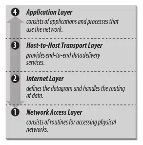
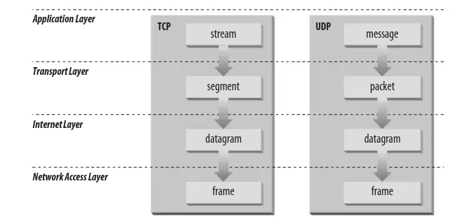

\clearpage

# Rappel des bases réseau

\setcounter{secttocdepth}{2}
\secttoc
\setcounter{secttocdepth}{3}


\btwoc


Cette section se veut un rappel sur les concepts réseaux utiles au cours et à
l'administrateurice[^f_inclusion] réseaux. Pour plus de détails, nous renvoyons
le lecteur aux formations CISCO par exemple. 

\etwoc

## Modèle

\btwoc
\index{modèle TCP-IP}\index{TCP}\index{UPD}

En administration réseau nous nous contentons du modèle TCP-IP sous-modèle du modèle OSI. 

- La couche application (_application layer_) concerne les applications utilisées sur le reseau : `http`, `smtp`, `ftp`, `telnet`… 

- La couche transport (_host-to-host transport layer_) concerne le service de transport de données. Il y a deux protocoles : 

    - **TCP** _transmission control protocol_ service de transport de données avec détection et corrections d'erreurs, orienté connexion.

        TCP vérifie que le système distant est prêt à recevoir les données avant de les envoyer. Lorsque la poignée de main est faite, le système dit qu'il a établi la connexion.

    - **UDP** _user datagram protocol_ service de transport de datagrammes sans connexion.

  

_Figure : Modèle TCP-IP (source : TCP/IP Craig Hunt)_

- La couche internet (_internet layer_) est la couche **IP**.

    IP est un protocole sans connexion. Ses rôles sont : 
    - définir le datagramme (_datagram_) qui est l'unité de base pour la
      transmission sur internet;
    - définir le schema des adresses sur internet;
    - acheminer les données entre la couche _network_ et la couche _transport_;
    - router les datagrammes;
    - s'occuper de la fragmentation et du réassemblage des datagrammes. 

    **ICMP** _internet control message protocol_ est un protocole inhérent à IP
    utilisant les datagrammes IP pour du contrôle, des rapports d'erreurs et de
    l'information.

    - _flow control_ lorsque les datagrammes arrivent trop vite pour être
      traités, la destination ou une passerelle (_gateway_) intermédiaire envoie
      un _ICMP Source Quench Message_ à l'expéditeur demandant d'interrompre
      l'envoi de manière temporaire;

    - _detecting unreachable destinations_ lorsque le système détecte que la
      destination n'est pas atteignable, le système envoie un datagramme
      _Destination Unreachable Message_. Si la destination est un réseau ou un
      hôte, le message est envoyé par une passerelle intermédiaire. S'il s'agit
      d'un port inatteignable, c'est l'hôte qui envoie le message;

    - _redirecting routes_ une passerelle envoie le message _ICMP Redirect
      Message_ pour demander à un hôte d'utiliser une autre passerelle
      probablement parce que celle-ci est un meilleur choix. Ce message n'est
      envoyé que sur un même réseau. 

    - _checking remote hosts_ un hôte peut envoyer un message _ICMP Echo
      Message_ pour tester si un système distant est _up_ et opérationnel.
      Lorsqu'un système reçoit ce message il (peut) y répondre en renvoyant le
      paquet. `ping` utilise ce message. 


- La couche réseau (_network access layer_) est la couche **Ethernet**.

\etwoc



_Figure : TCP et UDP dans le modèle TCP-Ip (source : TCP/IP Craig Hunt)_

\btwoc
\index{Ethernet}\index{IP}\index{ARP}\index{ICMP}
\etwoc
\yaline

## Adresses 

\btwoc
\index{IPv4}\index{IPv6}

### Adresse IPv4

\index{IPv4}

Une adresse IPv4 est une valeur de **32 bits** habituellement écrite comme 4
valeurs décimales séparées par un point « `.` » (_dotted decimal notation_ )
chaque nombre décimal représente 8 bits de l'adresse de 32 bits, chacun des
nombres se trouvant dans l'intervalle 0-255.

Une adresse IPv4 se compose de deux parties : 

- la première partie représente le numéro du **réseau** ;
- la seconde partie le numéro d'un **hôte** dans le réseau.

C'est le _masque_ de réseau qui détermine **où** l'on coupe l'adresse en deux.
Ce masque est composé d'un nombre de bits à 1 suivi d'un nombre de bits à 0.

Un réseau `/8` — anciennement, de classe A — a les 8 bits de gauche
— les bits de poids forts — à 1. Son masque (_netmask_) est
`11111111000000000000000000000000` en base 2 ou `255.0.0.0` en base 10 et en
regroupant les bits par paquets de 8 (par byte).  

Par exemple, l'IPv4 `10.0.0.1/8` représente : 

- le réseau `10` ;
- la machine `0.0.1`. 

Dans ce reseau numéro 10, il est possible d'avoir 16_777_214 hôtes (2^24-2). Les
adresses `10.0.0.0` et `10.255.255.255` étant réservées respectivement pour le
numéro de réseau et le _broadcast_. 

L'adresse IPv4 de la boucle locale (_loopback_) est `127.0.0.1`.

\etwoc

### Adresse IPv6

\btwoc

\index{IPv6}


Une adresse IPv6 est une valeur de **128 bits** (16 bytes)[^f_040_1]. La
représentation hexadécimale regroupe les octets par 2 séparés par deux points
« `:` ». Ce qui fait 8 groupes de 4 chiffres hexadécimaux. Par exemple :  

```
2001:0db8:0000:85a3:0000:0000:\
  ac1f:8001
```

Il est permis de remplacer `0000` par `0` et de supprimer des groupes nuls tant que l'adresse ne devient pas ambiguë. L'adresse précédente peut s'écrire : 

`2001:0db8:0:85a3::ac1f:8001`

Les datagrammes IPv6 ont été simplifiés et ne comportent plus que 7 champs au
lieu de 14 pour l'IPv4 ce qui accélère les traitements au niveau des routers. 

Une adresse peut être un identifiant pour une interface (_unicast_) ou pour un
ensemble d'interfaces (_multicast_). En ce sens, une interface peut avoir
plusieurs adresses IPv6. 

La notion de masque subsiste. Le préfixe est l'élément commun à toutes les adresses d'une même plage. La plupart du temps, le masque est `/64`. 

Le _broadcast_ est remplacé par le _multicast_. 

Les types d'adresse IPv6[@iana-ipv6] [@goffinet] : 

- les adresses _unicast_ désignant une destination unique (un hôte) : 

    - la boucle locale (_localhost_) `::1/128` ;
    - l'adresse locale (_link local_) `FE80::/10` non routable utilisable au sein d'un réseau local ;
    - l'adresse publique (_global unicast_) `2000::/3`[^f_040_2] ;
    - l'adresse privée (_unique local_) `FC00::/7` est l'équivalent des plages d'adresses privées en IPv4. Le 8^e^ bit doit être positionné à 1 ce qui donne le préfique `FD00::/8` pour un réseau local ;
    
- les adresses  _anycast_ qui sont des adresses pour lesquels le chemin emprunté
  est au plus proche ou au plus efficient ;

- les adresses _multicast_ `FF00::/8` remplacent les adresses de _broadcast_ désignant potentiellement plusieurs destinations :

    - les 4 bits les moins significatifs du 2^e^ byte (`FF0s::`) identifient la portée de l'adresse : 
    
        `1` locale à l'hôte  
        `2` locale au lien   
        `5` locale au site  
        `8` locale à l'organisation   
        `e` globale  
    
\index{MAC}

Il existe plusieurs techniques pour assigner une adresse en fixant l'identifiant d'interface (les 64 bits de poids faibles) :

- l'identifiant d'interface  peut être fixé de manière arbitraire ;

- l'identifiant d'interface peut être configuré automatiquement : 

    - déduit de l'adresse MAC (cfr. RFC 4862) en utilisant par exemple MAC
      EUI-64 (cfr. RFC 4291). Comme ces techniques exposent l'adresse MAC, elles
      sont déconseillées par IETF depuis 2017 ;
      
    - autoconfiguration basée sur une clé secrète et le préfixe reseau (cfr.
      RFC 7217)
    
    - autoconfiguration par un tirage pseudo-aléatoire (cfr. RFC 4941).
    
    - obtenu **dynamiquement** à partir de `DHCPv6`

ARP est remplacé par **ND** (_neighbor discovery_) et des messages `ICMPv6`. 

L'adresse IPv6 de la boucle locale (_loopback_) est `::1`.

[^f_040_1]: Ce qui fait 2^128^ adresses possibles, soit ± 3 10^38^. Pour l'image, si la surface de la terre était recouverte d'ordinateurs ayant chacun, une IPv6, il serait possible d'allouer 7 10^23^ adresses IP / m^2^ (_source commentcamarche.net_). 

[^f_040_2]: C'est bien `/3` et donc `200`. Les adresses unicast globales `2001::/16` peuvent être réservées et sont allouées par bloc `/23` à `/12` par l'IANA[@iana]. L'IANA alloue aux RIR (_regional internet registry_) — RIPE NCC pour l'europe — qui allouent à leur tour au LIR (_local internet registry_) qui sont généralement également fournisseur d'accès. Les adresses `2002::/16` sont utilisées par _6to4_ pour acheminer du trafic IPv6 vers IPv6 à travers IPv4. Les autres adresses sont réservées à un usage ultérieure. Ceci explique pourquoi les adresses unicast globales IPv6 sont de la forme `2001…`.

\etwoc
\yaline

## Routage élémentaire

\btwoc
\index{routage}

Les passerelles routent les données à travers le réseau. Pour ce faire, les
composants réseaux, les passerelles et les hôtes, doivent prendre des décisions
de routage. 

Pour la plupart des hôtes les décisions sont simples: 

- si la destination est sur le réseau local, les données sont délivrées à l'hôte;
- si la destination est sur un reseau distant, les données sont transmises à la passerelle locale. 

Une telle table de routage peut avoir cette allure en IPv4: 

```bash
alice@harmony:~$ ip route
default via 192.168.1.1 \
    dev eth0 onlink 
192.168.1.0/24 dev eth0 proto kernel \
    scope link src 192.168.1.11 \
    metric 100 
```
Remarque: depuis le noyau 3.6, il n'y a plus de cache pour le routage IPv4. 

\etwoc
\yaline
\newpage

## Résolution d'adresse

\btwoc

L'adresse IP et la table de routage adresse un datagramme à un réseau cependant
le datagramme doit passer par la couche physique. L'adresse IP doit être mappée
à une adresse physique dépendante du réseau physique ; habituellement
**ethernet**. 

Le protocole faisant la traduction IP → Ethernet est **ARP** _address resolution protocol_ pour IPv4 et **NDP** _neighbor discovery protocol_ pour IPv6. 

ARP maintient une table de correspondance entre adresse IP et adresse Ethernet
ou adresse MAC. Lorsque ARP reçoit une demande de traduction d'une adresse IP,
il regarde dans sa table. Si l'adresse s'y trouve, il la retourne sinon, ARP
broadcaste un packet à tous les hôtes sur le segment. Le paquet contient l'IP
concernée. Si un hôte a cette IP, il répond et la correspondance IP-Ethernet est
cachée — au sens mise en cache — dans la table ARP. 

\etwoc
\yaline

## Noms

\btwoc
\index{hostname}
\index{dns}

Chaque système porte un nom, son nom d'hôte (_hostname_) qui associé au nom de domaine (_domainname_) devrait être unique. 

Sur une machine linux, le nom d'hôte est renseigné dans `/etc/hostname`. Il peut être lu ou changé _via_ la commande `hostname`. 

Le nom de domaine est donné par la commande `dnsdomanname` pour obtenir le nom dns et `[yp]domainname` pour obtenir le nom de domaine au sens NIS/YP (_yellow pages_)[^f_040_3]. 

\index{fqdn}

La méthode recommandée pour positionner le **fqdn** (_fully qualified domain
name_) est d'écrire un _alias_ au nom d'hôte dans le fichier `/etc/hosts`. Par exemple : 

```conf
127.0.0.1 harmony.example.org harmony
```

Par défaut le fichier `/etc/hosts` est lu avant de faire une requête DNS. 

\etwoc
\yaline

[^f_040_3]: NIS (_network information system_) et ses _yellow pages_ ne sera pas abordé dans ces notes. 


## Le coin des commandes

\btwoc

### `ip`

`ip` est la commande à tout faire pour la configuration du réseau[^f_040_4]. Elle se présente comme `ip <object> [<command>]` par défaut, c'est la commande `show` (_alias_ pour `list`) qui est exécutée. Les objets peuvent être abrégés. 

`ip address` (ou `ip a`) pour l'adressage IPv4 ou IPv6. 

```bash
ip a
ip -6 a
ip a show dev eth0
ip a delete 2001:0db8:85a3…/64 dev eth0
```

- montre toutes les interfaces réseaux (IPv4 et IPv6)
- montre toutes les interfaces reseaux en se limitant à IPv6
- montre l'interface _eth_
- efface l'adresse précisée de l'interface eth0

`ip route` (ou `ip r`) pour manipuler la table de routage.

```bash
ip r 
ip r add default via 10.0.0.1 dev eth0
ip -6 r add 2001:db8:1::/64 \
    via 2001:db8:42::1 dev eth0
```

- montre la table de routage
- ajoute une route par défaut via `10.0.0.1` sur l'interface _eth0_
- ajoute une route pour le réseau `2001:db8:1::/64` via `2001:db8:42::1` sur l'interface _eth0_

\index{ARP}

`ip neighbour` (ou `ip neigh` ou `ip n`) pour manipuler les tables des voisins. Pour IPv4, il s'agit de la table ARP.

```bash
ip n 
ip n flush dev eth0
```
- montre la table 
- supprime les entrées de la table pour _eth0_

### `hostname`

\index{hostname}

`hostname` montre ou positionne le nom d'hôte de la machine. 

```bash
hostname
hostname --fqdn
```

- montre le nom d'hôte
- montre le nom d'hôte ainsi que le domaine

### `netstat`

\index{netstat}

`netstat` affiche les connexions réseaux, les tables de routage, les statistiques des interfaces… 

Voici quelques options[^f_040_6] :

- `-r`, `--route` permet l'affichage des tables de routages
- `-i`, `--interfaces` montre une table de toutes les interfaces réseau
- `-6` par défaut les commandes sont en IPv6, cette option demande l'IPv6
- `-p`, `--programs` affiche le nom et le _pid_ des processus propriétaire de chaque socket
- `-a`, `--all` affiche tous les sockets (par défaut connectés)
- `-e`, `--extend` donne quelques infos supplémentaires
- `-c`, `--continuous` pour afficher de manière continue
- `-l`, `--listening` affiche les sockets en écoute 

```bash
netstat -rn
netstat -r6
netstat -p
netstat -lapute
```

- affiche les tables de routage IPv4 au format numérique
- affiche les tables de routage IPv6
- affiche tous les sockets ouverts
- affiche un peu tout[^f_040_5]


### `dig`

\index{dig}
\index{DNS}
\index{resolv.conf}

`dig [@server] [name] [type) [class]` est une commande pour l'interrogation d'un
serveur DNS. 

- `-4`, `-6` demande de faire la requête en IPv4 ou en IPv6
- `<type>` représente le type de requête demandé : A, AAAA, NS…
- `<name>` est le nom de la resource : `example.org`…
- `@server` précise le serveur DNS utilisé. Si aucun serveur n'est renseigné, c'est le serveur défini dans `/etc/resolv.conf` que est utilisé
- `+trace` fait la demande à partir du serveur de nom racine et montre les réponses de chaque serveur de nom. 

```bash
dig
dig example.org
dig example.org MX
dig @127.0.0.1 +trace example.org 
```

- montre les serveurs racines
- montre l'adresse IP associée au nom `example.org`
- montre le champ `MX` associé au nom `example.org`
- demande au serveur local l'adresse IP associée à `example.org` avec une trace des différentes requêtes. 

\vspace{1cm }

\etwoc

[^f_040_4]: Cette commande remplace `ifconfig`\index{ifconfig} avec `ip address`, `route`\index{route} avec `ip route` et `arp`\index{arp} avec `ip neighbour`. 

[^f_040_5]: `netstat` est sans doute la commande pour laquelle moult moyens mnémotechniques existent dans lequel chaque personne peut faire son choix: `-alpe --ip`, `-taupe`, `-lapute`.

[^f_040_6]: Exceptionnellement, je conseille de préférer l'aide en ligne (`netstat --help`) à la page de manuel. 