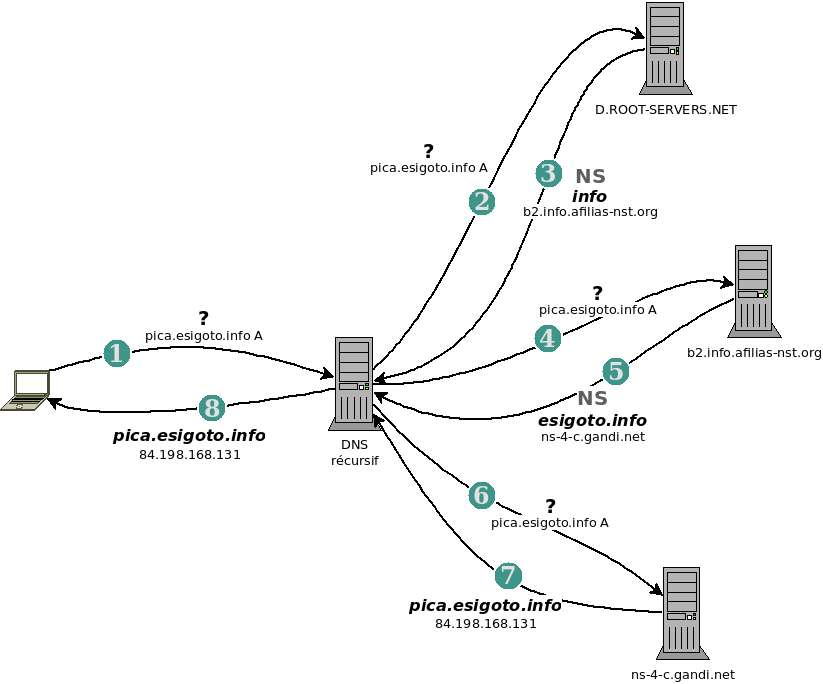

\clearpage

# `DNS` domain name system

\secttoc

\bintro

There is no place like 127.0.0.1… perhaps ::1

\eintro

\btwoc


Les adresses IP n'étant pas conviviales, nous retenons les noms de machines… un
serveur de noms permet de faire la correspondance entre un nom d'hôte et une
adresse IP. 

## La résolution de noms

\index{hosts}\index{NIS}\index{yellow pages}

Au commencement, les machines étaient peu nombreuses et rarement connectées à
internet. La correspondance entre les noms de machines et les adresses IP se
faisait dans le fichier `/etc/hosts`. 

Un fichier _hosts_ a l'allure suivante[^f_070_2] : 

```bash
$ cat /etc/hosts
127.0.0.1 localhost
127.0.0.1 harmony.in.esigoto.info \
    harmony
```

```bash
# The following lines are desirable 
# for IPv6 capable hosts
::1     localhost ip6-localhost \
    ip6-loopback
ff02::1 ip6-allnodes
ff02::2 ip6-allrouters
```

Avec l'agrandissement des réseaux locaux, et l'augmentation des tables d'hôtes à
maintenir sur ces machines, un service s'est chargé de recopier certains
fichiers de configuration entre machines. Il s'agit de `NIS` (_network
information server_). Les fichiers sont maintenus sur une seule machine, le
serveur, et les clients interrogent ce serveur plutôt que de lire la version
locale du fichier. 

Nous sommes dans les années 80, `NIS`[^f_070_1] centralise et facilite la
maintenance du fichier `/etc/hosts` mais également d'autres : `/etc/passwd`,
`/etc/group`… 

Plus tard, à partir de 1994, `DNS` lui sera préféré. En plus de mémoriser les
noms de machines locales, `DNS` permet de faire la recherche pour tous les noms
internet. Il permet la gestion d'un grand nombre de noms pas son système de
dissémination de l'information et de mise à jour. 

\index{nsswitch}

L'ordre dans lequel le système fait la résolution de noms se trouve dans le
fichier `/etc/nsswitch.conf` et plus particulièrement avec l'entrée `hosts` qui
peut avoir l'allure suivante par exemple : 

```bash
hosts: files mdns4_minimal \
    [NOTFOUND=return] dns
```

- dans ce cas, le nom d'hôte sera recherché dans le fichier _hosts_ puis _via_
  _multicast dns_ et enfin, par une requête auprès du serveur DNS.

### 1984, 2000, 2014

Ces années marquent au sujet des noms de domaines. 

Pour rappel, un nom de domaine est de la forme `example.org`. Une machine de ce
domaine portera par exemple le nom `harmony.example.org`. 

Les noms de domaine ont une structure hiérarchique. Chaque partie, appelée
label, est séparée par un point. La partie la plus à droite est le domaine de
premier niveau (_tld_ _top level domain_) et doit être choisie parmi les _tld_
existants.  
_Par exemple `org`_. 

La deuxième partie doit comporter entre 1 et 63
caractères et pour certains _tld_ peut être accentuée.   
_Par exemple `example`._

Ces deux parties forment ce que l'on appelle habituellement le nom de domaine.  
_Par exemple `example.org`._ 

À ces noms de domaine peuvent être ajoutés d'autres label pour former des
sous-domaines.   
_Par exemple `foo.example.org`,_   
_`bar.example.org`._

Au commencement toujours, les noms de domaine de premier niveau génériques
(_gtld_) sont : `com`, `net` et `org` rapidement suivi de `int`, `edu`, `gov` et
`mil`. Il s'agit des années 1984 et 1985. 

Les années 2000 voient fleurir quelques nouveaux noms de domaines : `biz`,
`info`, `aero`, `coop`, `museum`, `name`, `pro`, `jobs`, `travel`, `cat`,
`mobi`, `asia`, `tel`, `xxx`, `post` et `sexy`. Il est encore possible de les
recenser.  

À ces noms de domaines s'ajoutent les noms de domaines de premier niveau
nationaux (_cctld_) comme `be` pour la belgique. 

Puis en 2014, c'est l'explosion, toute personne désirant un nom de domaine de
premier niveau peut le demander et, moyennant finance, il sera disponible. À
l'heure où je rédige, je compte 1551[^f_070_3] nouveaux domaines de premiers
niveaux (_new gtld_) là où ils étaient 22 dans les années 80. 

La liste complète des noms de domaines de premiers niveaux se trouve sur le site
de l'IANA @iana-gtld. 

\etwoc
\yaline

## Fonctionnement d'un serveur DNS

\btwoc

> Serveur DNS ? Serveur DNS faisant autorité ou résolveur ? 

Lors de l'interrogation d'un serveur DNS, soit le serveur connait la réponse à
la question et la donne, soit il la cherche. 

Le DNS peut connaitre la réponse à la question parce que celle-ci se trouve dans
son **cache** ou parce que le serveur **a autorité pour la zone** concernée. Une
information a une certaine durée de vie (_TTL_, _time to live_) déterminée par
le serveur ayant autorité. Un serveur ayant autorité pour une zone (un domaine
de premier niveau, un domaine, un sous-domaine) détient la liste des
correspondances IP/nom et nom/IP pour la zone. Il peut communiquer l'information
au serveur qui la demande. Si le serveur ne connait pas la réponse, il la
cherche. 

\index{resolver}

Il existe différents types de serveurs DNS : 

- les **résolveurs** (_resolver_)[^f_070_5] ou serveur DNS « à cache seul »,

    ces serveurs ont une bonne mémoire puisqu'ils ne peuvent répondre qu'avec les informations détenues en cache.

    S'ils n'ont pas l'information en cache, ils interrogent un serveur racine (voir ci-dessous) s'ils sont récursifs (_recurcive_) ou un autre résolveur appelé _forwarder_ s'ils ne le sont pas. 

- les serveurs « faisant autorité » (_authoritative server_) pour une ou
  plusieurs zones,

    ces serveurs détiennent un fichier par zone[^f_070_4] contenant les correspondances entre les adresses IP et les noms. 

    Parmi ces serveurs ayant autorité, certains seront des **serveurs maitres** — détenant effectivement les fichiers de zone — et d'autres seront des **serveurs esclaves** qui obtiennent leurs fichiers d'un serveur maitre. 

Ces deux aspects sont très différents et doivent être bien compris. Là où le
résolveur donne la réponse contenue dans son cache, le serveur ayant autorité
donne la réponse qu'il connait. La réponse qui se trouve dans un fichier de
configuration ou autre. Les données ayant autorités doivent toujours être
prioritaires sur les données contenues dans le cache. Si les deux services sont
séparés, lors de l'interrogation d'un résolver, le client sait que la réponse
n'a pas autorité et qu'elle a une durée de vie limitée. Elle n'est peut-être
plus valable et il faudra un peu de temps — dépendant de la durée de validité de
la donnée — pour obtenir la « bonne » valeur. Lors de l'interrogation d'un
serveur ayant autorité, le client sait que l'information reçue est toute
fraiche.

Dans ces notes, nous traitons avec `bind` qui est capable d'assumer
convenablement les deux rôles.

### Fonctionnement d'une requête

Un serveur DNS résolveur récursif a un fonctionnement **top/down** avec
**cache**.

Détaillons le fonctionnement d'une requête DNS faites par un résolveur DNS
récursif. Lorsqu'il ne connait pas la réponse à la question posée, il la
cherche. Pour ce faire, le serveur interroge l'un des **serveurs racines**
(_root servers_) — au hasard dans la liste qu'il détient. Aujourd'hui, la liste
des serveurs racines est la suivante (extrait) : 

\etwoc

```bash
$ cut /etc/bind/db.root
;       This file holds the information on root name servers needed to
;       initialize cache of Internet domain name servers
;       (e.g. reference this file in the "cache  .  <file>"
;       configuration file of BIND domain name servers).
;
;       This file is made available by InterNIC 
;       under anonymous FTP as
;           file                /domain/named.cache
;           on server           FTP.INTERNIC.NET
;       -OR-                    RS.INTERNIC.NET
;
;       last update:    February 17, 2016
;       related version of root zone:   2016021701
;
; formerly NS.INTERNIC.NET
;
.                        3600000      NS    A.ROOT-SERVERS.NET.
A.ROOT-SERVERS.NET.      3600000      A     198.41.0.4
A.ROOT-SERVERS.NET.      3600000      AAAA  2001:503:ba3e::2:30
;
;; --cut-- 
;
; OPERATED BY ICANN
;
.                        3600000      NS    L.ROOT-SERVERS.NET.
L.ROOT-SERVERS.NET.      3600000      A     199.7.83.42
L.ROOT-SERVERS.NET.      3600000      AAAA  2001:500:3::42
;
; OPERATED BY WIDE
;
.                        3600000      NS    M.ROOT-SERVERS.NET.
M.ROOT-SERVERS.NET.      3600000      A     202.12.27.33
M.ROOT-SERVERS.NET.      3600000      AAAA  2001:dc3::35
; End of file

```

\btwoc

Le serveur racine (_root server_) interrogé répond en renseignant l'IP — plutôt
_une_ IP — du serveur ayant autorité pour la zone de premier niveau concernée.
Le serveur DNS requérant interroge alors cette nouvelle IP. Si le serveur
interrogé à autorité, il répond, sinon, il renseigne le serveur ayant autorité
pour le sous-domaine… et ainsi de suite jusqu'à la réponse. Une fois la réponse
obtenue, le serveur DNS requérant conserve la réponse en cache pendant sa durée
de vie (_TTL_). 

Par exemple, pour une requête `pica.esigoto.info` faite _via_ `dig +trace pica.esigoto.info` (extraits) et en vous aidant du schéma : 

- demande au serveur DNS qui répond avec la liste des serveurs racines ;

```
.  3600000 IN NS D.ROOT-SERVERS.NET.
.  3600000 IN NS L.ROOT-SERVERS.NET.              
.  3600000 IN NS F.ROOT-SERVERS.NET.
.  3600000 IN NS K.ROOT-SERVERS.NET.
.  3600000 IN NS M.ROOT-SERVERS.NET.
.  3600000 IN NS I.ROOT-SERVERS.NET.
.  3600000 IN NS E.ROOT-SERVERS.NET.
.  3600000 IN NS H.ROOT-SERVERS.NET.
.  3600000 IN NS J.ROOT-SERVERS.NET.
.  3600000 IN NS C.ROOT-SERVERS.NET.
.  3600000 IN NS B.ROOT-SERVERS.NET.
.  3600000 IN NS A.ROOT-SERVERS.NET.
.  3600000 IN NS G.ROOT-SERVERS.NET.
```

- demande à `D.ROOT-SERVERS.NET` qui répond avec la liste des serveurs ayant
  autorité pour la zone `info` ; 

```
info. 172800 IN NS a0.info\
    .afilias-nst.info.
info. 172800 IN NS a2.info\
    .afilias-nst.info.
info. 172800 IN NS b0.info\
    .afilias-nst.org.
info. 172800 IN NS b2.info\
    .afilias-nst.org.
info. 172800 IN NS c0.info\
    .afilias-nst.info.
info. 172800 IN NS d0.info\
    .afilias-nst.org.
```

- demande à `b2.info.afilias-nst.org` qui répond avec la liste des serveurs
  ayant autorité pour la zone `esigoto.info` ; 

```
esigoto.info. 86400 IN NS \
    ns-4-c.gandi.net.
esigoto.info. 86400 IN NS \
    ns-167-b.gandi.net.
esigoto.info. 86400 IN NS \
    ns-83-a.gandi.net.
```

- demande à `ns-4-c.gandi.net` qui répond avec l'adresse IP de l'hôte _pica_ car
  il a autorité pour la zone `esigoto.info` et connait donc la réponse ;

```
pica.esigoto.info.  1800  IN  \
    A  84.198.168.131
```

- la requête est bien *top/down* et le serveur requérant conservera en cache
  l'information pendant sa durée de validité. 

\etwoc



\btwoc

Un résolveur _forwarder_ quant-à lui fera la requête auprès de son _forwarder_
qui répondra si la réponse est dans son cache ou qui exécutera la requête sinon…
_via_ un autre _forwarder_ ou de manière récursive en fonction de sa
configuration. 

### Une question de confiance

Il y a deux aspects au sujet de la notion de **confiance** dans le service DNS :

- la confiance dans le serveur lui-même ; 
- la confiance dans le réseau. 

#### Confiance dans le serveur DNS

Éliminons de suite la confiance dans le logiciel lui-même qui dépendra bien sûr
du logiciel choisi : _bind_ dans ces notes et c'est pareil pour _unbound_. Pour
le logiciel libre, à l'habitude, le code peut-être audité et il est donc
possible de vérifier que le logiciel fait bien ce qu'il prétend. Accordons notre
confiance à _bind_ et à _unbound_. 

Bien que quasi personne ne choisisse quel serveur il utilise, ce devrait être
fait car un serveur DNS peut **mentir** ou **bloquer** certaines requêtes
[@blog-dns-bloque] [@blog-dns-menteur]. Un serveur DNS peut mentir pour gagner
de l'argent, pour respecter les lois —  ou se plier aux contraintes c'est
selon — d'un état… 

\index{FAI}

Lorsque l'on ne choisit pas son résolveur DNS, c'est le serveur DHCP qui le
propose et, dans un réseau local, c'est la _box_ qui sera résolveur DNS. Ce
résolveur est généralement _forwarder_ et le _forwarder_, est le résolveur DNS
du fournisseur d'accès à internet (_FAI_).

Dans ces conditions quelle confiance accorde-t-on à son FAI ?  
Quelles sont les raisons qui pourraient le faire mentir ou le faire bloquer des requêtes ?

Il est alors possible de choisir un résolveur public. Les plus connus
aujourd'hui sont ceux de Google `8.8.8.8` et de Cloudfare `1.1.1.1`. Ces
serveurs n'utilisent (probablement[^f_070_8]) pas `bind`. Ils s'annoncent plus
rapides puisqu'ils font plus rarement de requêtes récursives auprès des serveurs
racines, ont de bonnes connections réseaux… 

Ces serveurs me bloquent-ils ? Me mentent-ils ?  
Quelles sont les informations, ou plutôt quelle quantité d'informations
récoltent-ils ?  
_Quid_ de ma vie privée ? 
Que reste-t-il de la décentralisation du service ? 

Il est enfin possible enfin, d'installer son propre résolveur. Pour sa machine
ou pour son réseau local. Si beaucoup de personnes font ce choix, cela peut
avoir un impact sur les serveurs racines dont la charge risque d'augmenter. 

_Bref, tout n'est pas blanc ou noir…_

#### Confiance dans le réseau

\index{doh}\index{dot}

Ceci étant dit, un autre aspect de la confiance dans ce service est notre
intimité et les requêtes DNS circulent par défaut en clair sur le réseau. Je
peux me connecter en `https` au site `example.org` et personne ne saura ce que
je consulte hormis le propriétaire du site mais _tout le monde_ saura que j'y
accède puisque ma demande de résolution de nom circulera en clair. 

Si mon résolveur est sur ma machine, pas de problème, seul l'administrateurice
aura accès aux requêtes qui sont effectuées… mais pas que. Le résolveur se
trouvant sur ma machine va sortir ses requêtes en clair et une personne à
l'écoute de mon réseau pourrait les voir. 

Ne parlons pas de l'utilisation d'un serveur public. Le chemin est long entre ma
machine et `1.1.1.1` par exemple. 

Deux solutions existent pour remédier à cet aspect : 

- **DNS sur TLS** (_dot_) encapsule les requêtes DNS dans une connexion chiffrée avec TLS ; 
- **DNS sur HTTPS** (_doh_) encapsule les requêtes DNS dans une connexion chiffrée avec HTTPS. 

L'avantage de la seconde sur la première est aussi un désavantage, elle permet
l'utilisation de `HTTPS` qui est généralement disponible _un peu partout_. Les
ports sont généralement laissés ouverts. Pour le reste, les concepts sont
identiques. 

Les serveurs publics tels que _Cloudflare_ par exemple proposent ces services.

_doh_ et _dot_ peuvent être mise en œuvre à l'aide de `dnsdist`… ce qui sort du
cadre de ces notes. 

\etwoc
\yaline

## Les différents champs et les fichiers de zone

\btwoc

La requête DNS par défaut est celle demandant l'adresse IP correspondant au nom,
c'est une requête pour l'enregistrement `A`. Il existe différents types
d'enregistrements disponibles sur le site de l'IANA @iana-records. Voici les principaux : 

- `A` adresse IPv4 (_host address_)
- `AAAA` adresse IPv6 (_host IPv6 address_)
- `NS` serveur de nom ayant autorité (_authoritative name server_)
- `CNAME` alias (_canonical name for an alias_)
- `SOA` début du fichiers de zone (_start of a zone of authority_)
- `PTR` nom de domaine (_domain name pointer_)
- `MX` serveur de mail (_mail exchange_)
- `TXT` zone de texte (_text strings_)
- `DNSKEY` TODO (_dnskey_)
- `AXFR` transfert de zone (_transfer of an entire zone_)

Ce sont ces différents types d'enregistrements que contiennent les fichiers de
zone. Un fichier de zone contient :

- l'enregistrement `SOA` précisant la zone, il est requis et c'est le premier enregistrement ;
- un enregistrement `NS` précisant le serveur de nom ayant autorité pour la zone, il est requis ; 
- des enregistrements `MX` précisant le serveur de mail. Idéalement ils sont au moins deux ; 
- des enregistrements `A`, `AAAA` et `CNAME` pour les zones ; 
- des enregistrements `PTR` pour les zones inverses ;
- des enregistrements `TXT`,

    ces enregistrements contiennent différentes informations. Par exemple, des commentaires pour la validation d'un certificat _https_, des valeurs `SPF`, `DMARK`… pour la sécurisation et la paramétrisation des serveurs de mails… 

La zone locale a cette allure : 

\etwoc

```bash
$TTL    604800
@ IN SOA localhost. root.localhost. (
         2         ; Serial
    604800         ; Refresh
     86400         ; Retry
    419200         ; Expire
    604800 )       ; Negative Cache TTL
;
  IN NS      localhost.
@ IN A       127.0.0.1
@ IN AAAA    ::1
```
\btwoc

Comme illustration d'une zone plus générale, la zone `esigoto.info` ayant
quelques services en IPv4 et en IPv6 pourrait avoir cette allure : 

\etwoc

```bash
@ 10800 SOA ns1.gandi.net. hostmaster.gandi.net. (
    2021030501 2h 30m 30d 1h
)
@ 10800 IN MX 10 spool.mail.gandi.net.
@ 10800 IN MX 50 fb.mail.gandi.net.
@ 10800 IN A 91.121.216.124
@ 10800 IN AAAA 2001:41d0:8:52c9:0:ff:fee3:bd57

atacama 1800 IN A 84.198.168.129
atacama 1800 IN TXT "v=spf1 ip4:84.198.168.129 mx -all"

pica 1800 IN A 84.198.168.131
pica 1800 IN TXT "v=spf1 ip4:84.198.168.131 mx -all"
vlab 1800 IN CNAME pica
vlabesi 1800 IN CNAME pica

date 10800 IN CNAME momos.hipocoon.be.
imap 10800 IN CNAME access.mail.gandi.net.
paste 10800 IN A 91.121.216.124
paste 10800 IN AAAA 2001:41d0:8:52c9:0:ff:fee3:bd57
smtp 10800 IN CNAME relay.mail.gandi.net.
www 10800 IN A 91.121.216.124
www 10800 IN AAAA 2001:41d0:8:52c9:0:ff:fee3:bd57
```

\btwoc

- les commentaires du champ `SOA` ne sont pas présents. Les commentaires ne sont
  pas obligatoires ;
- les valeurs ne sont pas toutes données en secondes mais avec une unité. Par exemple `h` pour les heures ;
- deux champs `MX` sont proposés et une priorité est donnée aux serveurs de
  mails : l'une de 10 et l'autre de 50 ;


\etwoc
\yaline

## `bind9`

\btwoc
\index{bind}

`bind` (_Berkeley Internet Name Daemon_) est sans nul doute l'implémentation la
plus répandue du DNS. La première version date de 1984 et `bind9` est une
réécriture des versions plus anciennes qui prend en charge _DNSSEC_ par exemple.

`bind9` peut jouer le rôle de résolveur **et** de serveur DNS ayant autorité. 

`unbound` quant-à lui est un résolveur DNS beaucoup plus récent (2004) pouvant
avantageusement remplacer `bind` lorsqu'il n'est pas nécessaire d'avoir aussi un serveur DNS ayant autorité.

> Dans ces notes nous présentons essentiellement `bind9`. 

L'installation de `bind9` est aussi simple que :

```bash
# apt install bind9
```

Les fichiers de configuration de `bind9` se trouvent dans `/etc/bind/`. Le
répertoire a l'allure suivante (_debian buster_) : 

```bash
$ tree /etc/bind
/etc/bind
├── bind.keys
├── db.0
├── db.127
├── db.255
├── db.local
├── db.root
├── named.conf
├── named.conf.default-zones
├── named.conf.local
├── named.conf.options
├── rndc.key
└── zones.rfc1918
```

\index{zone}

Les fichiers `db.*` définissent les zones (cfr. ci-dessus). Le choix du nom de
ces fichiers est libre. 

`named.conf` est le point d'entrée de la configuration de _bind_. Chez _debian_, il contient des _includes_ vers les fichiers `named.conf.*` : 

- `named.conf.options` contient les options dans la section `options { }` dédiée. 

    Principalement les interfaces sur lesquels le serveur va répondre. Par défaut le serveur DNS est local ; 

- `named.conf.local` contient les zones pour lesquels le serveur a autorité
  (_master_ et _slave_). Chacune dans une section _zone_, par exemple `zone
  "example.org" { }` ;

- `named.conf.default-zones` contient les zones par défaut : le _broadcast_ `db.0`, la zone inverse pour la boucle locale `db.127`, la zone inverse pour le _broadcast_ `db.255`, la boucle locale `db.local`, la zone _._ `db.root`[^f_070_6] ;

- `bind.keys` contient la clé _DNSSEC_ pour les serveurs racines. 

    FIXME développer cet aspect

\index{rndc}

- `rndc.key` contient le _hash_ de la clé d'accès au serveur bind _via_ rndc ; 

- `zones.rfc1918` définit toutes les zones correspondant aux classes d'adresses
  privées comme étant vides.

Une fois la configuration faite, le service se gère à l'aide de _systemd_ _via_ la commande `systemctl` comme habituellement. 

Au sujet des _logs_, ils se trouvent dans `/etc/syslog` dès lors que _bind_ est
configuré pour parler. Ceci peut se faire en ajoutant une section _logging_ au
fichier de configuration. Cette section peut avoir l'allure suivante (très
verbeuse)_: 

```bash
logging {
  category default { default_syslog; \
    default_debug; };
  category security { default_syslog;\
     default_debug; };
  category database { default_syslog;\
     default_debug; };
  category resolver { default_syslog;\
     default_debug; };
  category queries { default_syslog; \
    default_debug; };
  category unmatched { null ; };
};
```

\etwoc
\yaline

## La configuration du _stub resolver_, le fichier `resolv.conf`

\index{resolv.conf}
\btwoc

Le résolveur — ou _stub resolver_ — est un ensemble de routines de la librairie
C qui donne accès au DNS. Les programmes susceptibles de faire appel à ces
routines sont nombreux. Il s'agit de tous les programmes nécessitant une
résolution de noms. Par exemple : `ssh`, `git`, `owncloud`, `dropbox`… mais
surtout les navigateurs[^f_070_7]. 

Le _stub resolver_ se configure dans le fichier `/etc/resolv.conf` qui aura au
minimum l'allure suivante : 

```bash 
nameserver <IP>
```
où `IP` représente l'adresse IP du serveur DNS résolveur à interroger.

À cette ligne peuvent s'ajouter d'autres informations comme le domaine (_domain_)
dans lequel se trouve la machine, des noms de domaines dans lesquels chercher un
nom d'hôte (_search_), un _timeout_ éventuel, un nombre de tentatives
(_attempts_)… Habituellement, un fichier `resolv.conf` dans une configuration familiale aura l'allure suivante : 

```bash
search domainname
nameserver 192.168.1.1
```
le serveur DNS résolveur utilisé est celui de la _box_. 

Pour utiliser un serveur DNS résolveur local et demander au _stub resolver_
d'ajouter un nom de domaine aux noms « sans point », un fichier `resolv.conf`
pourrait avoir cette allure :

```bash
search in.esigoto.info
nameserver ::1
nameserver 127.0.0.1
```

**Remarque** Il serait facile de croire que la modification du fichier
`resolv.conf` suffit à modifier le serveur DNS résolveur. C'est exact lorsqu'il
n'y a pas un programme qui met ce fichier à jour. Dans le cas d'un serveur DHCP,
le système reçoit le nom du résolveur du serveur DHCP… ce qui écrase les
valeurs écrites « à la main » dans _resolv.conf_. 

Dans ce cas, une manière de faire est de ne pas demander l'adresse du résolveur
au serveur DHCP. Ceci peut être fait en **retirant le mot
`domain-name-servers`** du fichier `/etc/dhcp/dhclient.conf`. 

\etwoc
\yaline

## `DNS` menteur ou _response policy zone_ (mais c'est moins vendeur)

\btwoc

Un serveur DNS peut mentir ou bloquer des requêtes. Si ton DNS te bloque, tu
croiras que le site n'existe pas. C'est de la censure. Si ton DNS te ment, tu
seras dirigé vers une autre page. 

Faire mentir, c'est mettre en place en place **RPZ** *Response Policy Zone*.
[Bortzmeyer][bortzmeyer] et [Paul Vixie][paulvixie] expliquent le
principe qui est décrit dans la [documentation de bind9][binddoc] §6.2.16.20 p98-.

Pour indiquer à bind que l'on veut utiliser la RPZ (*response policy zone*) il
faut l'ajouter dans les options; 

```
response-policy { zone "liar.local";};
```

Cette zone peut être une zone définie ailleurs et contenant une liste de sites
à bloquer ou bien je peux la définir moi-même… 

Ajouter:

```
zone "liar.local" {
	type master;
	file "/etc/bind/db.local.liar.local";
  allow-query {none;};
};
```

Ajouter le fichier de zone. 

Pour rappel, 

- pour qu'un nom soit renseigné comme inexistant (*undefined*), 
  ```bash
  <name> CNAME .
  ```

- pour qu'un nom soit renseigné comme vide (*empty set of resources*), 
  ```bash
  <name> CNAME *.
  ```

- pour remplacer l'IP,

  ```bash
  <name> A <IP>
  <name> AAAA <IP>
  ```

dans l'exemple suivant;

```conf
$TTL 1h
@ SOA eve.liar.local. root.localhost. (
	2017030302
	2h 30m 30d 1h
)
  NS eve.liar.local. 

eve	IN	A	127.0.0.1

example.be CNAME .
example.org A 127.0.0.1
example.com CNAME	eve.liar.local.
```

- `example.be` ne répondra pas, le nom n'étant pas définé ;
- `example.org` répondra avec l'adresse de la boucle locale ; 
- `example.com` sera redirigé vers `eve.liar.local`.

\etwoc
\yaline

## Le coin des commandes

\btwoc

### dig

\index{dig}

`dig` est une commande permettant d'interroger un serveur DNS.

À chaque réponse sont associés des drapeaux (_flags_) en voici quelques uns : 

- `AA` _Authoritative Answer_ (RFC1035)
- `TC` _Truncated Response_ (RFC1035)
- `RD` _Recursion Desired_ (RFC1035)
- `RA` _Recursion Available_ (RFC1035)

Requête simple auprès du résolveur configuré par défaut pour obtenir l'adresse
IP correspondant au nom. 

\etwoc

```bash
$ dig esigoto.info

; <<>> DiG 9.11.5-P4-5.1+deb10u3-Debian <<>> esigoto.info
;; global options: +cmd
;; Got answer:
;; ->>HEADER<<- opcode: QUERY, status: NOERROR, id: 10754
;; flags: qr rd ra; QUERY: 1, ANSWER: 1, AUTHORITY: 3, ADDITIONAL: 3

;; OPT PSEUDOSECTION:
; EDNS: version: 0, flags:; udp: 4096
; COOKIE: 2e6152d9a4eee435fad46701604b6c9bc051247825ee77d9 (good)
;; QUESTION SECTION:
;esigoto.info.			IN	A

;; ANSWER SECTION:
esigoto.info.		10741	IN	A	91.121.216.124

;; AUTHORITY SECTION:
esigoto.info.		78196	IN	NS	ns-4-c.gandi.net.
esigoto.info.		78196	IN	NS	ns-167-b.gandi.net.
esigoto.info.		78196	IN	NS	ns-83-a.gandi.net.

;; ADDITIONAL SECTION:
ns-4-c.gandi.net.	570	IN	A	217.70.187.5
ns-4-c.gandi.net.	570	IN	AAAA	2604:3400:aaac::5

;; Query time: 8 msec
;; SERVER: 127.0.0.1#53(127.0.0.1)
;; WHEN: ven mar 12 14:28:59 CET 2021
;; MSG SIZE  rcvd: 204
```

\btwoc

Le résolveur interrogé n'a pas autorité pour la zone. 

- les _flags_ `ra` et `rd` signifie qu'il y a eu récursion ; 
- la valeur du _ttl_, ici 78196, n'est pas « entière » et une prochaine requête identique verrait décroitre cette valeur. 

La même requête auprès d'un serveur DNS ayant autorité donnerait : 

\etwoc

```bash
$ dig esigoto.info @ns-4-c.gandi.net

; <<>> DiG 9.11.5-P4-5.1+deb10u3-Debian <<>> esigoto.info @ns-4-c.gandi.net
;; global options: +cmd
;; Got answer:
;; ->>HEADER<<- opcode: QUERY, status: NOERROR, id: 7687
;; flags: qr aa rd; QUERY: 1, ANSWER: 1, AUTHORITY: 0, ADDITIONAL: 1
;; WARNING: recursion requested but not available

;; OPT PSEUDOSECTION:
; EDNS: version: 0, flags:; udp: 1232
;; QUESTION SECTION:
;esigoto.info.			IN	A

;; ANSWER SECTION:
esigoto.info.		10800	IN	A	91.121.216.124

;; Query time: 22 msec
;; SERVER: 2604:3400:aaac::5#53(2604:3400:aaac::5)
;; WHEN: ven mar 12 14:41:36 CET 2021
;; MSG SIZE  rcvd: 57

```

\btwoc

Le serveur ayant autorité pour la zone, 

- le _flag_ `aa` est levé et signifie que c'est une réponse d'autorité ;
- la valeur du _ttl_, ici 10800, est telle que définie dans le fichier de zone ; 

Demande à un serveur racine la liste des serveurs racines (sans paramètre, c'est
le comportement par défaut de `dig`) :

```bash
dig . NS @a.root-servers.net
dig 
```

L'option _trace_ demande de montrer la requête récursive : `dig +trace example.org`. 

L'option _search_ demande d'ajouter le nom de domaine à la requête : `dig +search pica`.

L'option _short_ donne une réponse (très) courte. 

Il est possible d'utiliser l'enregistrement (_record_) `AXFR` pour initier un transfert de zone. C'est une faille de sécurité que d'autorisé ce transfert de zone. Cette commande devrait donc échouer[^f_070_9].

```bash
dig axfr example.org
```

### Localiser une adresse IP

Il peut être intéressant de savoir à quelle région est attribuée une adresse IP,
voire à quelle fournisseur d'accès (_FAI_). Pour ce faire, il faut utiliser un
service tiers, par exemple [ipapi.co](//ipapi.co). Dans une console, une requête
peut avoir cette allure : 

```bash
$ curl https://ipapi.co/<IP>/yaml
$ curl https://ipapi.co/<IP>/yaml -s \
    | awk '/country\_name|region|org/'
```

1. version longue au format `yaml`;
2. version réduite au pays, à la région et à l'organisation éventuelle.


\etwoc


[^f_070_1]: `NIS` s'appelle d'abord _yellow pages_ et, bien après avoir été
renommé, certaines commandes commencent encore par `yp`. 

[^f_070_2]: Souvent un fichier _hosts_ ne résout plus que la boucle locale et, éventuellement, des noms à des fins de tests. 

[^f_070_3]: Les noms des domaines de premier niveau commençant par `a` : 
.aaa 
.aarp 
.abarth 
.abb 
.abbott 
.abbvie 
.abc 
.able 
.abogado 
.abudhabi 
.ac 
.academy 
.accenture 
.accountant 
.accountants 
.aco 
.active 
.actor 
.ad 
.adac 
.ads 
.adult 
.ae 
.aeg 
.aero 
.aetna 
.af 
.afamilycompany
.afl 
.africa 
.ag 
.agakhan 
.agency 
.ai 
.aig 
.aigo 
.airbus 
.airforce 
.airtel 
.akdn 
.al 
.alfaromeo 
.alibaba 
.alipay 
.allfinanz 
.allstate 
.ally 
.alsace 
.alstom 
.am 
.amazon 
.americanexpress
.americanfamily
.amex 
.amfam 
.amica 
.amsterdam 
.an 
.analytics 
.android 
.anquan 
.anz 
.ao 
.aol 
.apartments 
.app 
.apple 
.aq 
.aquarelle 
.ar 
.arab 
.aramco 
.archi 
.army 
.arpa 
.art 
.arte 
.as 
.asda 
.asia 
.associates 
.at 
.athleta 
.attorney 
.au 
.auction 
.audi 
.audible 
.audio 
.auspost 
.author 
.auto 
.autos 
.avianca 
.aw 
.aws 
.ax 
.axa 
.az 

[^f_070_4]: Ils en auront généralement deux par zone ; un pour la zone et la résolution nom → IP et un second pour la _zone inverse_ et la résolution IP → nom. 

[^f_070_5]: Le terme résolveur peut prêter à confusion. Il ne faudra pas
confondre le résolveur dans le sens de la partie du serveur DNS faisant la
résolution de nom pour remplir son cache — le résolveur — et la configuration du
résolveur du système qui précise quel est le serveur DNS à utiliser — le _stub_
résolveur. Cette dernière configuration étant généralement faites dans le
fichier `/etc/resolv.conf`. Nous y reviendrons. 

[^f_070_6]: Dans les paquets récents de _bind_, ce n'est plus le fichier `db.root` qui est utilisé, mais le fichier `/usr/share/dns/root.hints`. C'est une bonne pratique de vérifier — à partir de `named.conf` quels fichiers de configuration sont utilisés. Ceci peut varier d'une distribution à l'autre. 

\index{cloudfare}

[^f_070_7]: Les navigateurs sont configurés par défaut pour pour utiliser le serveur DNS défini par le système. Pour un réseau local, ce serveur DNS est celui de la _box_ (routeur-modem donnant accès à internet) et se réfère au serveur DNS du fournisseur d'accès à interenet (_FAI_). Les navigateurs modernes peuvent être configurés pour faire leurs requêtes DNS _via_ HTTPS (_doh_). Dans ce cas, une configuration habituelle est d'utiliser un serveur DNS chez *Cloudflare*. Il en existe d'autres. Il est possible d'utiliser son serveur DNS local bien sûr. Dans un réseau d'entreprise, ce sont les administrateurices systèmes qui déterminent où sont faites les requêtes DNS. 

[^f_070_8]: Probablement pas puisque ces services ne documentent pas vraiment. 

[^f_070_9]: N'étant pas le seul à vouloir illustrer le transfert de zone, [Robin des Bois](https://digi.ninja/projects/zonetransferme.php) (_sic_) met une zone à disposition autorisant ce transfert de zone. À l'heure ou j'écris `dig dig axfr zonetransfer.me @nsztm1.digi.ninja` fonctionne. 

[bortzmeyer]:http://www.bortzmeyer.org/rpz-faire-mentir-resolveur-dns.html
[blog]:http://namok.be/blog/?post/2016/10/18/quand-ton-serveur-dns-te-bloque-ou-te-ment
[paulvixie]:https://www.dns-oarc.net/files/workshop-201103/rpz2.pdf
[binddoc]:http://www.bind9.net/arm910.pdf