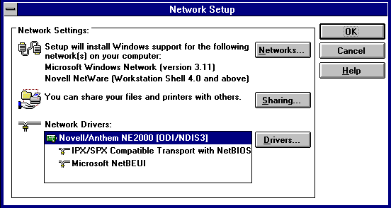

\clearpage

# SAMBA ou l'intégration de machines MS Windows et GNU Linux

\secttoc
\btwoc


## Une histoire de protocoles

SMB ou CIFS est le protocole natif de communication entre machines MS Windows et linux. 

\index{NetBIOS}

**NetBIOS** (_Network Basic Input Output System_) est une version étendue de BIOS,
prenant en charge les échanges de données sur un réseau local grâce à un
protocole de transport approprié. 

Il y a deux implémentations de _NetBIOS_, l'une, **NBT**  s'appuyant sur TCP/IP
est aujourd'hui la norme tandis que l'autre, **NetBEUI** (_NetBIOS Extended User
Interface_) n'est plus utilisée. 

L'interface NetBIOS consiste en un ensemble de services permettant d'identifier
et de gérer des connexions entre systèmes. Ces différents services sont : 

- le service de noms ; noms de groupe de travail (_workgroup_) et noms de machine ;
- le service de sessions ; 
- le service de datagrammes pour l'envoi d'informations sans connexion. 

C'est un mode de nommage en couche 4, sur les ports 137, 138 et 139. 

Un nom NetBIOS se compose de 16 caractères : 15 pour le nom et le 16^e^ pour le rôle. Un machine déclare au minimum deux noms : le nom de machine et celui du _workgroup_. 

Voici la liste des caractères associés aux différents rôles : 

\etwoc

--------------------------------------------------------------------------
Name                Number(h)  Type  Usage
------------------- ---------- ----- -------------------------------------
`<computername>`         00       U    Workstation Service

`<computername>`         01       U    Messenger Service

`<\\--__MSBROWSE__>`     01       G    Master Browser

`<computername>`         03       U    Messenger Service

`<computername>`         06       U    RAS Server Service

`<computername>`         1F       U    NetDDE Service

`<computername>`         20       U    File Server Service

`<computername>`         21       U    RAS Client Service

`<computername>`         22       U    Microsoft Exchange Interchange(MSMail
                                       Connector)

`<computername>`         23       U    Microsoft Exchange Store

`<computername>`         24       U    Microsoft Exchange Directory

`<computername>`         30       U    Modem Sharing Server Service

`<computername>`         31       U    Modem Sharing Client Service

`<computername>`         43       U    SMS Clients Remote Control

`<computername>`         44       U    SMS Administrators Remote Control
                                       Tool

`<computername>`         45       U    SMS Clients Remote Chat

`<computername>`         46       U    SMS Clients Remote Transfer

`<computername>`         4C       U    DEC Pathworks TCPIP service on
                                       Windows NT

`<computername>`         42       U    mccaffee anti-virus

`<computername>`         52       U    DEC Pathworks TCPIP service on
                                       Windows NT

`<computername>`         87       U    Microsoft Exchange MTA

`<computername>`         6A       U    Microsoft Exchange IMC

`<computername>`         BE       U    Network Monitor Agent

`<computername>`         BF       U    Network Monitor Application

`<username>    `         03       U    Messenger Service

`<domain>      `         00       G    Domain Name

`<domain>      `         1B       U    Domain Master Browser

`<domain>      `         1C       G    Domain Controllers

`<domain>      `         1D       U    Master Browser

`<domain>      `         1E       G    Browser Service Elections

`<INet~Services>`        1C       G    IIS

`<IS~computer name>`     00       U    IIS

`<computername>`         [2B]     U    Lotus Notes Server Service
--------------------------------------------------------------------------

\btwoc 

**SMB** (_Server Message Block_) prend en charge les services de niveau supérieur.
Il se base sur des échanges de messages relatifs à la session, au contrôle des
fichiers, à l'impression et à la communication. 

Historiquement, SMB est apparu avec **Microsoft 3.1 _for workgroup_** en
octobre 1992. C'est la première version de Microsoft Windows supportant le
travail en groupe et le (fameux) _voisinage réseau_. C'est l'époque des cables
coaxiaux sans IP.  



Les notions de domaines et de groupes de travail (_workgroups_) se réfèrent à la
notion de systèmes participant à un même réseau. Tous ces systèmes utilisent la
même liste de machines ; la liste de _browsing_. Cette liste de _browsing_ est
fournie au client par le maitre d'exploration principal (_master browser_). Elle
est associée à un groupe de travail et est utile pour limiter les _broadcasts_
lors de la résolution des noms netbios. 

La liste de _browsing_ est un service de la couche 2 : NetBIOS. 

\index{domaine}\index{workgroup}

Un domaine ou un groupe de travail (_workgroup_) est le nom donné à un ensemble
de machines. Ces machines pourront partager des ressources. Ce concept est
différent du **domaine de sécurité MS Windows** géré par un contrôleur de
domaine : anciennement un **contrôleur de domaine principal** (PDC _primary
domain controler_) ou actuellement un _**active directory**_ (AD).

**WINS** (_Microsoft Windows Internet Name Service_) est le service de nom
internet de Microsoft Windows. Le serveur WINS maintient la liste des noms
NetBios se trouvant dans le réseau. Dans le cas de NBT, il maintient la
correspondance _nom NetBIOS / IP_. WINS permet d'éviter le _broadcast_ sur le
réseau ; au lieu d'un _broadcast_ une machine se signale directement au serveur
WINS. La présence d'un serveur WINS permet de « passer les routeurs »[^f_072_4].

- un client (au _boot_ ou au lancement de Samba) demande au serveur WINS
  d'ajouter son nom et son IP. La requête est acceptée si l'adresse n'est pas
  utilisée[^f_072_1]. 
- lorsque le clien (ou le service Samba) s'arrête, le système avise le serveur
  WINS qui rend le nom disponible. 

**Remarque** : le protocole NetBIOS n'est pas routable, IP oui. 

**Samba** est une suite d'outils utilisant le protocole SMB pour l'échange de
données entre machines Linux / Linux ou Linux/MS Windows.

\etwoc

## Installation

\btwoc

L'installation n'appelle pas de commentaire. Samba est disponible dans les
paquets de la distribution. Comme toujours, on privilégiera l'intallation _via_
le gestionnaire de paquets plutôt qu'à partir des sources. 

\etwoc
\yaline

## Les dæmons

\btwoc

Samba est associé aux dæmons : 

- **smbd** (_smb dæmon_) pour le partage des systèmes de fichiers et des imprimantes, l'authentification et les droit d'accès ; 

- **nmbd** (_name server NetBIOS dæmon_) est associé au service de noms WINS et prend en charge la résolution de noms. Il peut-être configuré pour être _master browser_ par exemple…

- **windbind** FIXME

Les services peuvent être gérés à l'aide de `systemctl` comme d'habitude. 

\etwoc
\yaline

## Configuration de Samba

\btwoc

La configuration de Samba se fait dans un unique fichier `smb.conf`
habituellement dans `/etc/samba/smb.conf`[^f_072_3]. 

Ce fichier se décompose en **sections**. Chaque section débute par un nom, le
nom de service, écrite entre crochet « `[]` ». La section se termine par le
début de la suivante ou la fin de fichier. Chaque section correspond à un
partage excepté la section `[global]` généralement en début de fichier. 

Il existe trois sections particulières : 

- **`[global]`** Définit les paramètres communs du serveur pour le partage de
    toutes les ressources. Les options définies dans cette section s'appliquent
    à tous les autres partages comme si le contenu de la section y était copié.
    Heureusement, une option définie dans `[global]` peut être reprise et
    modifiée dans une autre section.

- **`[homes]`** Permet à un ou une utilisateurice distante d'accéder à son
    répertoire _home_ (`/home/alice`). Ce compte sera connecté à son répertoire
    si ce répertoire personnel existe, il doit donc posséder un compte sur la
    machine ! 

    Supposons qu'une machine cliente tente de se connecter à un partage _alice_
    sur un serveur. Aucun partage de ce nom n'est défini dans le fichier
    `smb.conf` mais il existe une section `[homes]`. Samba trouve le compte
    utilisateur _alice_ dans la base des mots de passe, puis compare les mots de
    passe. Si les deux mots de passe concordent, Samba crée un partage `alice`
    pour le client, ce partage sera `/home/alice`. 

- **`[printers]`** Cette section définit les paramètres pour le partage des
    imprimantes. Cette section permet d'éviter de définir un partage par
    imprimante. Samba vérifie dans le fichier `/etc/printcap` si c'est une
    imprimante et la met à disposition du client.

    Il est également possible de définir une section particulière (par exemple
    `[yaprinter]` définissant le partage de l'imprimante. Cette section
    contiendra le paramètre `printable = yes` indiquant que le partage se
    rapporte à une imprimante. 

À la suite d'un nom de section, se trouve la liste des **paramètres**. Chaque
ligne est de la forme : 

```bash
param = value
```

Les lignes de **commentaires** commencent par un hashtag « `#` » ou par un point
virgule « `;` ». 

\index{signal}

Le fichier de configuration de Samba est rechargé chaque minute. Il est possible de forcer la relecture du fichier de configuration de Samba en envoyant le signal `SIGHUP` au serveur comme ceci : 

```bash
kill -SIGHUP <pid smbd>
kill -SIGHUP <pid nmbd>
```

ou plus simplement en utilisant `systemctl` et 

```bash
systemctl reload smbd nmbd
```

### Variables

Le fichier de configuration peut contenir des variables fixant les
caractéristiques du serveur Samba et des clients qui s'y connectent. Ces
variables sont de la forme `%A`.

Cas d'usage : supposons que le réseau comporte plusieurs clients susceptibles de
se connecter au serveur mais que l'utilisateur `bob` nécessite une configuration
particulière pour la section `[homes]`. En écrivant cette configuration dans
`/etc/samba/smb-bob.conf`, le fichier _smb.conf_ pourra avoir cette allure : 

```conf
[homes]
    ; …
    include = /etc/samba/smb-%m.conf
    ; …
```

Dans ce cas si le fichier existe, l'_include_ se fera sinon, aucune erreur ne
sera générée (ce qui est pratique pour toutes les autres connexions).

Voici la liste des variables issue de Samba @samba.

\etwoc
\clearpage

|**Variable**|  **Définition**                                |
|------------|  ----------------------------------------------|
|_Variables clients_                                         ||
|`%a`        |   Architecture du client (Samba, MS Windows…)  |
|`%I`        |    Adresse IP du client                        |
|`%m`        |   Nom NetBIOS du client                        |
|`%M`        |    Nom DNS du client                           |
|_Variables utilisateur_                                     ||
|`%u`        |    Nom d’utilisateur Unix actuel               |
|`%U`        |    Nom d’utilisateur client demandé            |
|            |   (parfois inusité par Samba)                  |
|`%g`        |    Groupe principal de `%u`                    |
|`%G`        |    Groupe principal de `%U`                    |
|`%H`        |   Répertoire de base de `%u`                   |
|_Variable de partage_                                       ||
|`%p`        |   Chemin d’accès du montage automatique        |
|            |   associé au répertoire                        |
|            |   racine du partage (si différent de `%P` )    |
|`%P`        |   Répertoire racine du partage en cours        |
|`%S`        |   Nom du partage en cours                      |
|_Variables serveur_                                         ||
|`%d`        |   ID de processus du serveur en cours          |
|`%h`        |   Nom d’hôte du serveur Samba                  |
|`%L`        |   Nom NetBIOS du serveur Samba                 |
|`%N`        |   Serveur de répertoire de base établi         |
|            |   à partir de la table                         |
|            |   d’automount                                  |
|`%v`        |   Version de Samba                             |
|_Autres variables_                                          ||
|`%R`        |   Niveau de protocole SMB pris en compte       |
|            |   dans la négociation                          |
|`%T`        |   Date et heure courantes                      |


\clearpage

### Configuration de la liste d'exploration

\btwoc

L'exploration (_browsing_) désigne la fonction permettant d'examiner les
serveurs et les partages disponibles sur un réseau. Cette liste est visible dans
le _voisinage réseau_. 


C'est le client qui informe par _broadcast_ le maitre explorateur (_master
browser_) ou directement le serveur WINS de sa présence par une annonce
`__MS_BROWSE__`. 

L'option `browsable` permet de montrer ou cacher un partage tout comme l'ajout
d'un dollar « `$` » en début de nom de partage permet de le faire avec MS
Windows.

Un des machines du réseau, celle ayant le rôle `1D` d'explorateur local de
domaine (_local master browser_), est responsable de la conservation, mise à
jour et diffusion de cette liste. D'autres options interviennent dans l'élection
de sa _master browser_ que nous ne détaillons pas ici. Il s'agit des options :
_os level_, _local master_, _netbios name_, _server string_, _preferred master_…

\etwoc
\yaline

### Authentification des utilisateurices

\btwoc

Le paramètre `security` définit le type d'authentification pour le serveur. Ce
paramètre peut prendre les valeurs `user`, `ads` ou `domain` (voire `auto`). La
valeur par défaut est `user`[^f_072_2]. 

- **`user`** Le client doit se connecter avec des identifiants valides avant
  tout. 

    Le nom de la ressource à laquelle le client veut se connecter n'est pas
    transmis au serveur tant que le client n'est pas authentifié. C'est pourquoi
    pour qu'un partage _guest ok_ ne sera pas accessible sans authentification
    excepté si le serveur associe les utilisateurs inconnus au compte _guest_.
    Cfr. `map to guest`. 

- **`domain`** Dans ce mode, le client doit rejoindre le domaine de sécurité MS
  Widows au sens _MS Windows NT_. 

- **`ads`** Dans ce mode, le client doit rejoindre le domaine de sécurité MS
  Windows au sens _membre d'un active directory_ (AD). Dans ce mode, Kerberos
  doit être installé et configuré. 

Les utilisateurices et leur mot de passe et éventuellement les groupes doivent
être stockés quelque part. Le paramètre `passdb backend` définit la manière dont
ils le seront. 

\index{ldap}

Les différents _backend_ sont : 

- **`smbpasswd`** l'ancien fichier plat ; 
- **`tdbsam`** la base de données triviale (_trivial data base_ **TDB**) est une base de données très simple ; 
- **`ldapsam`** l'url vers un annuaire LDAP. 

    L'url est optionnelle. Si elle est absente, ce sera `ldap://localhost`. 

```
passdb backend = tdbsam
passdb backend = tdbsam:/etc/samba\
    /private/passbd.tdb
passdb backend = ldapsam:\
    ldaps://ladp.example.org
```

Pour l'échange de secret entre le client et le serveur, Samba utilise un
protocole de type _challenge / response_. 

_L'idée étant que le client puisse convaincre le serveur qu'il connait le secret sans que celui-ci ne transite sur le canal non sûr._

1. le client envoie un premier message *negotiate_message* proposant différents protocoles ; 
2. le client répond avec un *challenge_message* ;
3. le client peut calculer un hash *authenticate_message* basé sur le *challenge_message* et sur le mot de passe ; 
4. après vérification, le serveur accept ou non. 

Ce protocole a évolué au gré des évolutions des algorithmes de hashage pour
passer de DES à MD5… Dans sa première version, Microsoft NT Lan Manager (_ntlm_)
utilise DES et ne devrait plus être utilisé aujourd'hui. 

- **`ntlm v1`** le _challenge_ est de 8 bytes (64 bits), les _hash_ font 16
  bytes et sont 
    - `LanMan`, un DES du message. Le message est limité à 14 caractères ASCII ou
    - `NT`, un MD4 encodés cette fois en UTF16
- **`ntlm v2`** à partir de _Microsoft Windows NT4 service pack 4_. Le _hash_ à
  une longueur de plus de 24 bytes et la fonction de hashage est MD4, MD5, HMAC
  MD5…

À l'heure de ses notes, c'est _ntlm v2_ qui est utilisé lorsqu'il n'est pas
utile de mettre en œuvre Kerberos. 

Au niveau des systèmes Microsoft Windows : LanMan est utilisé par les versions
de MS Windows inférieures à MS Windows NT (_aka_ MS Windows 95-98) et _ntlm v2_
n'est disponible qu'à partir de MS Windows NT4 SP4.

Kerberos n'est pas abordé dans ces notes. 

\etwoc
\yaline
\clearpage

## Le coin des commandes

\btwoc

### `smbclient`

`smbclient` est à l'origine l'outil de test d'une installation de Samba. _smbclient_ peut faire des transferts de fichiers « à la FTP », imprimer, archiver (`tar`), envoyer des messages, rechercher les services… 

```bash
smbclient -L <netbios name>
smbclient -L <hostname> 
smbclient -L <netbios| host name> \
    -U <user>

smbclient -L harmony -U alice
```
- liste les partages du serveur (`harmony`) pour le _user_ `alice`

```bash
smbclient //<netbios|host name>\
    /<share name>

smbclient //harmony/distri
```
- se connecte en _ftp-like_ au partage (`distri`) du serveur (`harmony`)

### `testparm`

`testparm` vérifie la validité syntaxique du fichier _smb.conf_. Il retourne la valeur des différents paramètres. 

```
testparm smb.conf
```

### `nmbloockup`

`nmbloockup` recherche les noms NetBIOS et les associe avec une adresse IP. 

```bash
nmbloockup [-A] <IP | netbios name>

nmbloockup harmony
nmbloockup -A 127.0.0.1
```


\etwoc

[^f_072_1]: C'est bien le client qui informe le serveur WINS de l'IP qu'il possède déjà pour que le serveur la mémorise. Il ne s'agit **pas d'obtenir** une adresse IP. Un serveur WINS n'est pas un serveur DHCP.  

[^f_072_2]: Les anciennes versions de Samba acceptaient les valeurs `share` et `server` qui ne sont plus d'actualité. 

[^f_072_3]: Pour demander à `smbd` quel fichier de configuration il lit : `smbd -b | grep smb.conf`

[^f_072_4]: Dès qu'une mécanisme arrête l'utilisation du _broadcast_ pour directement contacter une adresse IP sur un certain port… ce mécanisme peut quitter le segment et être routé. C'est par exemple, le cas de la liste d'exploration. 