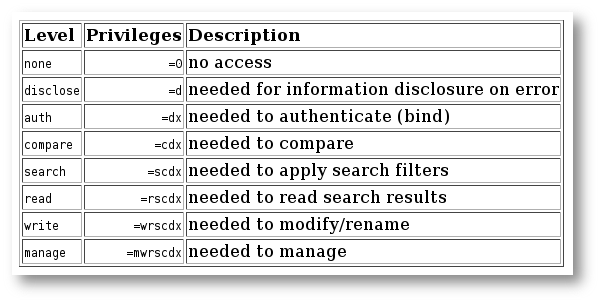

\newpage

# LDAP, Lightweight directory access protocol

\secttoc
\index{LDAP}
\bintro

FIXME trouver une intro

\eintro
\btwoc

LDAP définit un protocol d'accès à un **annuaire**. Un annuaire est une base de
données spécialisée et avec une structure forte. Les accès en lecture sont
réputés rapides. La recherche est efficace. Un annuaire n'est pas un système de
gestion de base de données (_SGBD_). Un annuaire peut contenir tout ce qui peut
être nommé. L'usage le plus fréquent est d'y stocker les utilisateurices de
l'entreprise. 

Un annuaire est destiné à être interrogé par des clients différents. 

LDAP fournit un protocole d'échange entre les clients LDAP et un serveur LDAP. Les services offerts par un annuaire sont : 

- un modèle d'information ; 

    Ce modèle fournit les structures et types des données nécessaires à la construction de l'arbre de l'annuaire LDAP. 

- un modèle de nommage ;

    Ce modèle définit comment les entrées et les données de l'arbre sont définies de manière unique. 

- un modèle fonctionnel ;

    Ce modèle fonctionnel est le protocole LDAP en lui-même. Il définit le moyen d'accéder aux données dans l'arbre de l'annuaire. Les accès sont la connexion, l'authentification, la recherche, la lecture, la modification…  

- un modèle de sécurité et de duplication.

\etwoc
\yaline
\newpage

## Modèle d'information

\btwoc

Un annuaire à une **structure en arbre**, la racine contient la description de
l'arbre, chaque nœud de l'arbre est une entrée et chaque nœud est un objet. 

Généralement le premier niveau est une décomposition en unité organisationnelle
(_organizational unit_). Par exemple, le département ressources humaines,
informatique, ventes… 

Un objet a un _nom_, un _identifiant_ et des attributs obligatoires et optionnels. 

**objectClass**  
_name_, _objectId_, _attributes_ (_must_ ou _may_) et _type_

L'identifiant d'objet (_objectId_) est normalisé (par la RFC 2256). Le numéro
représentant l'_objectId_ respecte une certaine hiérarchie et un numéro peut
être attribué à une société sur simple demande. Le numéro attribué à l'ESI est
`1.3.6.1.4.1.23162` (cfr [IANA enterprise
numbers](https://www.iana.org/assignments/enterprise-numbers/enterprise-numbers)).
À partir de ce numéro, l'entreprise peut créer les identifiants qu'elle désire.
Par exemple `1.3.6.1.4.1.23162.1`, `1.3.6.1.4.1.23162.2`…

La structure de ce numéro est la suivante. Pour l'exemple on ajoute un numéro
pour _le local 504_ puisque en-dessous du numéro attribué l'entreprise est
libre de s'organiser comme elle l'entend : 

```
iso(1)
|- org(3)
|--- dod(6)
|---- internet (1)
|----- private (4)
|------- enterprise (1)
|-------- esi.be (23162)
|--------- local504 (504)
```

Une classe d'objet peut par exemple, représenter une personne, sa définition est
alors la suivante : 

```
objectclass ( 2.5.6.6 NAME 'person'                                               
    DESC 'RFC2256: a person'                                                      
    SUP top STRUCTURAL                                                            
    MUST ( sn $ cn )                                                              
    MAY ( userPassword 
    $ telephoneNumber 
    $ seeAlso 
    $ description ) )   
```
- le nom est `person` ;
- l'_objectId_ est `2.5.6.6` ;
- l'objet est structurel et n'a pas de parent ;
- les attributs `sn` (_surname_) et `cn` (_common name_) sont obligatoires
  (_MUST_), les autres facultatifs (_MAY_)

Si cette classe, n'offre pas suffisamment d'attributs, il est possible d'utiliser une classe enfant, par exemple : 

```
objectclass ( 2.5.6.7 
  NAME 'organizationalPerson'                                 
  DESC 'RFC2256: an organizational person'                                      
  SUP person STRUCTURAL                                                         
  MAY ( title $ x121Address $ 
    registeredAddress $ 
    destinationIndicator $        
    preferredDeliveryMethod $ 
    telexNumber $ 
    teletexTerminalIdentifier $       
    telephoneNumber $ 
    internationaliSDNNumber $ 
    facsimileTelephoneNumber $ 
    street $ postOfficeBox $ 
    postalCode $ postalAddress $ 
    physicalDeliveryOfficeName $ 
    ou $ st $ l ) 
)         
```
- le nom est `organizationalPerson` ;
- l'_objectId_ est `2.5.6.7` ;
- l'objet est structurel et son parent est `person`… il hérite donc de ses
  attributs et peut les utiliser ; 
- les attributs `sn` et `cn` sont toujours obligatoires, les autres facultatifs.

Si cette classe n'offre pas suffisamment d'attributs, il est possible d'utiliser
une classe enfant, par exemple :

```
objectclass ( 2.16.840.1.113730.3.2.2                                             
  NAME 'inetOrgPerson'                                                          
  DESC 'RFC2798: Internet Org Person'                                
  SUP organizationalPerson                                                      
  STRUCTURAL                                                                    
  MAY (                                                                         
    audio $ businessCategory $ 
    carLicense $ departmentNumber $ 
    displayName $ employeeNumber $ 
    employeeType $ givenName $                 
    homePhone $ homePostalAddress $
    initials $ jpegPhoto $ 
    labeledURI $ mail $ manager $ 
    mobile $ o $ pager $                        
    photo $ roomNumber $ secretary 
    $ uid $ userCertificate $                  
    x500uniqueIdentifier $ 
    preferredLanguage $ 
    userSMIMECertificate $ userPKCS12 
    )
)        
```
Et ainsi de suite. 

Si aucune classe prédéfinie ne convient, il est possible de
définir ses propres classes. 

Les attributs sont également définis. 

**attributeType**  
_name_, _attributeId_, _description_

```ldif
attributetype ( 2.5.4.4 
  NAME ( 'sn' 'surname' )                                   
  DESC 'RFC2256: last (family) name(s) 
  for which the entity is known by'        
  SUP name 
) 
```

Ces définitions sont disponibles en ligne (site de l'IANA) ou dans les fichiers
`etc/ldap/schema/*`. Elles sont définies dans des **schémas**. À chaque
insertion, le serveur vérifie si l'entrée est conforme au schéma. C'est le
_schema checking_. 

\etwoc
\yaline

## Modèle de nommage

\btwoc
\index{DN}

Chaque nœud a un **identifiant unique** composé des attributs obligatoires pour
la classe d'objet utilisée. C'est le **_distinguished name_** (**DN**). Par
exemple : 

```ldif
uid=fpignon, ou=construction, 
  dc=example, dc=org
```

Les deux parties `dc` sont les composants du nom de domaine qui forment le nom
de la racine de l'annuaire. Pour la société `example.org`, la racine sera
`dc=example, dc=org`. 

L'attribut `dc` pour _domain component_ est défini dans le schema _core.schema_ : 

```
attributetype ( 0.9.2342.19200300.\
100.1.25                                        
  NAME ( 'dc' 'domainComponent' )                                               
  DESC 'RFC1274/2247: domain component'                                         
  EQUALITY caseIgnoreIA5Match                                                   
  SUBSTR caseIgnoreIA5SubstringsMatch                                           
  SYNTAX 1.3.6.1.4.1.1466.115.121.1.26 
  SINGLE-VALUE
)      
```
\etwoc
\yaline

## Format d'échange de données LDIF

\btwoc
\index{LDIF}

**LDIF** _LDAP Data Interchange Format_ est le format permettant l'échange des
données entre une application et un annuaire LDAP ou entre annuaires et la
modification des enregistrements. 

Le format complet est décrit dans RFC 2849 et la base dans les pages de manuel
`man ldif`.

_Remarque_ Les espaces et les passages de ligne ont une certaine importance :

- chaque ligne est terminée par un line feed (`<LF>`) ou carriage return suivi
  de line feed (`<CR><LF>`) ;
- une ligne commençant par un _hash_ « `#` » est un commentaire ;
- une ligne commençant par un espace (_<SPACE>_) continue la ligne qui précède ;
- une ligne vide permet de séparer deux entrées différentes tandis que ;
- une ligne commençant par un tiret (_dash_) « `-` » permet de terminer une
  opération et permet d'en commencer une nouvelle (sur la même entrée)

Une entrée est de la forme : 

```
dn: <distinguished name>
<attrdesc>: <attrvalue>
<attrdesc>: <attrvalue>
…
```

Un nœud de l'annuaire pourrait ressembler à : 

```
dn:cn=Marlène Sassœur, ou=student,
 dc=example,dc=be
objectclass: inetOrgPerson
cn: Marlene SASSOEUR
sn: Marlene
mail: marlene.sassoeur@dev.null
description: Elle me dit c'est Marlène 
sa sœur. Avouez que c'est confusant.
```

L'attribut _changetype_ permet de modifier une entrée, il peut prendre les
valeurs _modify_, _add_, _delete_ ou encore _modrdn_. Pas défaut, s'il est omis,
ce sera _add_. 

Dans le cas de _modify_ il faut choisir si l'attribut sera : ajouté, supprimé ou
modifié. 

- **add** – ajoute un attribut (si cet attribut existe déjà avec une autre valeur, une nouvelle paire attribut / valeur est ajoutée)

  ```
  add: <attribute-type>
  <attribute-type>: <value>
  ```
  Par exemple
  ```
  add: description
  description: My description
  ```

- **delete** – supprime tous les attributs de ce type sauf si l'on précise lequel on veut supprimer

  ```
  delete: <attribute-type>
  <attribute-type>: <value>
  ```
  Par exemple 
  ```
  delete: work-phone
  ```

  ```
  delete: mobileTelephonNumber
  mobiletelephonnumber: 
   +32 (0) 123 45 67 89
  ````

- **replace** – modifie l'attribut concerné. Si l'attribut a plusieurs valeurs,
  toutes les valeurs sont remplacées (s'il ne faut en remplacer qu'une, faire un
  delete suivi d'un add)

  ```
  replace: <attribute-type>
  <attribute-type>: <value>
  ```
  Par exemple

  ```
  replace: home-phone
  home-phone: +32 (2) 123 45 67 
  ```

Par exemples : 

```
dn:cn=Marlene Sassœur,ou=student,
 dc=example,dc=be
changetype : modify
add : telephonenumber
telephonenumber : 123 45 67 89
```

```
dn:cn=Marlene Sassœur,ou=student,
 dc=example,dc=be
changetype : delete
```

\etwoc
\yaline

## Modèle fonctionnel

\btwoc

Le modèle fonctionnel, est le protocole LDAP lui-même. Il fournit les moyens
d'accéder aux données dans l'arbre LDAP. L'accès aux données consiste en
l'authentification, les requêtes en lecture (recherche) et en écriture (ajout et
mise à jour).

> `OpenLDAP`

\etwoc
\yaline

### Implémentation du protocole : `OpenLDAP`

\btwoc

OpenLDAP est une implémentation libre du protocole LDAP. 

L'installation se résume à : 

```
# apt install slapd ldap-utils
```

Lors de l'installation, si aucun _rootDSE_ n'est demandé, c'est que _debian_
prend l'initiative d'utiliser _hostname.domainname_. Le plus simple si cela ne
convient pas est de reconfigurer le paquet : 

```
dpkg-reconfigure slapd
```

Le service se gère comme d'habitude avec `systemctl`. 

Le répertoire `/etc/ldap` contient : 

- les schémas dans `schemas` ; 
- `ldap.conf` fichier de configuration éventuel pour les utilitaires
  _`ldapfoo`_ ; 
- un répertoire `slapd.d` contenant l'annuaire de configuration de _openLDAP_. 

La configuration de l'annuaire est stockée… dans un autre annuaire nommé
`cn=config`. Voir figure \vref{fig:ldaptree}.

\etwoc

{#fig:ldaptree width=65%}


\yaline

### Schémas

\btwoc

Une des premières choses à faire est de vérifier que les schémas utiles sont
bien pris en compte par l'annuaire. Ceci peut se faire en cherchant dans le nœud
`cn=schema, cn=config`. Si ce n'est pas le cas, il suffit de les ajouter. 

Les schémas disponibles se trouvent dans `/etc/ldap/schemas`. Notez bien que ce
sont les schémas connus par _open ldap_ pas les schémas pris en compte par
l'annuaire. 

Il peut arriver que les schémas disponibles ne soient pas suffisants pour répondre aux attentes de l'entreprise. Dans cette hypothèse, il faudra créer son propre schéma c'est-à-dire un ensemble de classes et d'attributs. Pour ce faire : 

- choisir et structurer _objectId_ et _attributeId_ et les définir dans un
  fichier de schéma ; 
- ajouter le schéma à l'annuaire. 

La définition d'un objet peut avoir cette allure en utilisant le numéro
d'entreprise de l'ESI. 

```
#
# Local definition of yet another class 
#
attributetype ( 1.3.6.1.4.1.23162
.504.2.1 
  NAME 'yaName'
  EQUALITY caseIgnoreMatch
  SUBSTR caseIgnoreSubstringsMatch
  SYNTAX 1.3.6.1.4.1.1466.115
  .121.1.15{32768}
)

objectclass ( 1.3.6.1.4.1.23162
.504.1.1 
  NAME ' yaObject '
  SUP top STRUCTURAL
  MUST ( cn $ sn )
  MAY ( yaName $ …)
)
```

\etwoc
\yaline
\newpage

### ACL 

\btwoc
\index{ACL}

Les ACL (_access control list_) OpenLDAP permettent de préciser **qui** a accès
à **quoi** dans l'annuaire. 

Le **qui** peut être choisi parmi : _*_, _self_, _anonymous_, _user_ ou _regex_. 


Les niveaux d'accès sont, quant-à eux choisis parmi : _none_, _disclose_,
_auth_… et doivent être choisis dans l'ordre. Donner comme niveau d'accès
_write_, implique de donner les accès : _read_, _search_, _compare_, _auth_,
_disclose_ et _none_.

Chaque niveau d'accès à une certaine **portée** (_scope_) qui peut-être :
_base_, _one_, _subtree_ ou _children_.



Le **quoi** détermine les entrées concernées par l'ACL. Il est composé de trois
parties : une expression régulière déterminant le DN, un filtre de recherche et
une liste de noms d'attributs séparés par des virgules. Les ACL peuvent être
définies de manière dynamique, par le biais de fichier LDIF. C'est l'attribut
**`olcAccess`** qui définit cet accès.

**Exemples**

Un exemple simple donnant l'accès à tous en lecture,

```
olcAccess: to * by * read
```

Une directive donnant la possibilité à l'utilisateur de la modifier, aux
anonymes de s'authentifier, et aux autres de lire l'entrée.

```
olcAccess: to *
  by self write
  by anonymous auth
  by * read
```

Les entrées sous le sous-arbre `dc=com` sont accessibles en écriture, excepté
pour les entrées sous `dc=example,dc=com` pour lesquelles un accès en lecture
est autorisé.

```
olcAccess: to dn.children="dc=com"
  by * write
olcAccess: to dn.children=
 "dc=example,dc=com"
  by * read
```

**Remarque**

L'ordre dans lequel sont placées ces directives a de l'importance. Puisque cet
ordre a de l'importance, la partie « quoi » est affublée automatiquement lors de
l’ajout dans l’annuaire d'un numéro d'ordre placé entre accolades `{ i }`.

Si l'on crée les entrées
```
olcAccess: to attrs=member,entry
  by dnattr=member selfwrite
olcAccess: to dn.children=
 "dc=example,dc=com"
  by * search
olcAccess: to dn.children=
 "dc=com"
  by * read
```
ce sont ces entrées qui sont enregistrées
```
olcAccess: {0}to attrs=member,entry
  by dnattr=member selfwrite
olcAccess: {1}to dn.children=
 "dc=example,dc=com"
  by * search
olcAccess: {2}to dn.children="dc=com"
  by * read
```

\etwoc
\yaline

### Recherche 

\btwoc

La recherche la plus globale est la recherche « montre-moi tout ». Le filtre de
recherche est alors `"(objectclass=*)"`

Un filtre LDAP a la forme suivant : `( attribut opérateur valeur )`.

L' attribut est le nom de l'attribut ! L' opérateur est choisi parmi :

- `=` pour l'égalité,
- `~=` pour les comparaisons approximatives,
- `<=` pour les comparaisons « inférieur ou égal »,
- `>=` pour les comparaisons « supérieur ou égal »

La partie valeur peut être une valeur absolue (par exemple `cn=juste`) ou une
valeur reposant sur les wildcards (par exemple `cn=*blanc`).

Il est possible de regrouper des filtres élémentaires en utilisant les
opérateurs booléens, `&` (ET), `|` (OU) et `!` (NON). Ces opérateurs utilisent
la notation préfixée. 

Pour rechercher les enregistrements ayant comme nom « foo » ou
« bar », nous aurons 

```
(|(cn=foo)(cn=bar))
```

Pour rechercher des enregistrements des unités organisationnelles « Sales » et « RH » qui ont dans leur _cn_ « foo »

```
( &(|(ou=Sales)(ou=RH))(cn=*foo*) )
```


_Il existe d'autres implémentations ; Microsoft Active Directory est une
implémentation d'un annuaire qui « supporte » le protocole LDAP._ 

\etwoc
\yaline

## Le coin des commandes

\btwoc

\index{ldapsearch}

**`ldapsearch`**

_ldapsearch_ est l'outil de recherche dans l'annuaire. Il peut également
rechercher dans la configuration de l'annuaire. 

```
ldapsearch -LLL -Y EXTERNAL 
  -H ldapi:/// -b "cn=config"
ldapsearch -LLL -Y EXTERNAL 
  -H ldapi:/// -b "dc=example, dc=org"
```
- la première commande montre la configuration de l'annuaire, la seconde montre
  l'arbre _example.org_
- cette commande ne demande pas de mot de passe et doit être exécutée par _root_

```
ldapsearch -LLL 
  -D "cn=admin,dc=example,dc=org"
  -b "dc=example,dc=org"
  -x -W
```
- montre le contenu de l'arbre comme la commande précédente mais
  l'utilisateurice _admin_ doit s'identifier. 

```
ldapsearch -LLL -Y EXTERNAL 
  -H ldapi:/// -b "cn=schema,cn=config"
```
- montre les schémas connus par l'annuaire. 

```
ldapsearch -LLL
  -D "cn=user, dc=example,dc=org"
  -b "dc=example,dc=org"
  -x -W
  "(objectclass=*)
```
- fais une recherche de type « montre moi tout » à la base de l'annuaire.

Remarque : Afin d'éviter d'obtenir trop de résultats lors d'une recherche du
genre `(objectclass=*)`, ldapsearch permet de définir des limites quant-à
l'information retournée.

- `-l <value>`, définit en secondes, la durée d'attente maximale de la réponse à
  une demande de recherche.

- `-z <value>`, définit le nombre d'entrées maximal à récupérer lorsqu'une
  recherche aboutit.

Ces valeurs peuvent-être définie dans le fichier `ldap.conf` en utilisant les
paramètres ; _timelimit_ et _sizelimit_. Une valeur de 0 en ligne de commande
annule les limites imposées dans le fichier de configuration des utilitaires
ldap.


**`ldapadd`**

_ldapadd_ permet l'ajout dans l'annuaire, que ce soit dans la partie
configuration ou l'annuaire proprement dit. 

Pour faire un ajout dans un annuaire, il faut au préalable créer un fichier LDIF
contenant les enregistrements à ajouter. 

```bash
$ cat add.ldif
dn: ou=rh,dc=example,dc=org
objectClass: organizationalUnit
ou: rh
```
L'inclusion dans l'annuaire se fait grâce à : 

```
ldapadd -D "cn=admin,dc=example,dc=org" 
  -W 
  -f add.ldif
```

Pour ajouter des utilisateurices dans cet annuaire sous l'_OU_ _rh_, un fichier
LDIF pourrait être : 

```
$ cat add.ldif
# Entrée Juste LEBLANC
dn: cn=Juste LEBLANC,ou=rh,
 dc=example,dc=org
objectclass : inetOrgPerson
cn: Juste LEBLANC
sn: Juste
mail: juste.leblanc@dev.null
mail: juste@leblanc.name
description: Il s'appelle Juste Leblanc.
 Ah bon,il a pas de prénom.
```


\etwoc