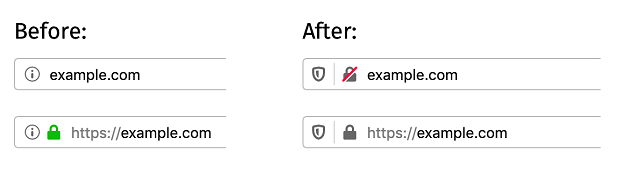

\newpage

# Serveur web

\secttoc
\index{Apache}\index{nginx}\index{html}\index{css}\index{Javascript}
\bintro

Un serveur web permet la mise à disposition de l'information sur un réseau

\eintro
\btwoc

L'information mise à disposition par le serveur web est visible grâce à un
navigateur (_browser_). C'est du texte balisé grâce au langage `HTML`
(_HyperText Markup Language_). Le HTML permet de structurer la page : titres,
sections, listes à puces… À ce langage HTML s'ajoute le `CSS` (_Cascading Style
Sheet_) qui permettra de le mettre en forme : en rouge, en vert, dans une autre
police, avec des marges plus grandes…

Les pages _web_ telles qu'elles s'affichent dans nos navigateurs maintenant sont
parfois réactives. Elles se sont plus simplement statiques. Elles réagissent aux
clics de souris. Elles interagissent avec l'utilisateurice. Ceci parce que les
navigateurs sont capables d'exécuter du code envoyé pas le serveur web. Ce
langage est le `JS` (_Javascript_).

Le texte envoyé par un serveur web n'est pas simplement : 

```html
Hello world
```

mais pourrait-être[^f_078_1] comme ci-dessous où il contient du HTML, du CSS et
du Javascript[^f_078_2] : 

\etwoc

```html
<!DOCTYPE html>
<style>
body {
    background-color: lightblue;
}
</style>
<html>
<title>Exemple</title>
<body>

<p id="demo" onclick="myFunction()">
    Hello world
</p>

<script>
function myFunction() {
  var x = document
    .getElementById("demo");
  x.style.fontSize = "25px"; 
  x.style.color = "red"; 
}
</script>
</body>
</html> 
```

[^f_078_1]: Exemple adapté de https://www.w3schools.com/ 

\btwoc
\index{HTTP}

Un serveur web est un service qui écoute, par défaut, sur les ports 80 et 443.
Il est en attente d'une requête `HTTP` (_HyperText Transfert Protocol_) ou
`HTTPS` (_HyperText Transfer Protocol Secured_) effectuée par le client
(généralement le navigateur). Il existe différent type de requêtes HTTP|S, les
plus connues étant `GET`, `HEAD` et `POST`. 

Une requête HTTP demandant la page web à l'adresse `http://example.org` a
l'allure suivante : 

```bash
GET /index.html HTTP/1.1
Host: example.org
```

Une fois la requête effectuée, le serveur web cherche dans ses documents s'il a
le fichier en question et le retourne. 

Un serveur web peut générer les pages HTML/CSS/JS en utilisant un langage de
script avant de les retourner. Par exemple `PHP`, _Ruby on rails_, `ASP`. Dans
ce cas, les fichiers stockés sur le serveur sont écrits dans ces langages et
sont interprètés avant d'être servis. Ceci demande des ressources au niveau du
serveur. 

Les serveurs web les plus répandus sont `Apache` et `nginx`. 

Dans ces notes, nous traiterons uniquement de `Apache`.

\etwoc
\yaline

## Installation et configuration 

\btwoc

Installation du paquet _apache2_ pour le serveur web et de paquets spécifiques
en fonction des modules que l'on veut rendre disponible. 

Si apache doit comprendre le PHP, il est nécessaire d'installer
_libapache2-mod-php7_ par exemple. 

Le fichier de configuration principal est `/etc/apache2/apache2.conf`. 

On y trouve entre autres, la configuration de l'_essaim_. En effet, un serveur
web a plusieurs processus qui écoutent et prennent en charge les demandes de
connexion. Les paramètres correspondant sont : 

```apache2
KeepAlive on 
MaxKeepAliveRequests 100
KeepAliveTimeout 10
Timeout 30
```

`KeepAlive` demande de garder la connexion ouverte un certain laps de temps pour
éviter au client de réouvrir une connexion s'il a encore besoin de données.
`MaxKeepAliveRequests` défini le nombre de requêtes concurrentes qui pourront
être traitées. Les _time out_ déterminent le temps (en secondes) avant qu'une
connexion soit fermée. 

\index{.htaccess}

Une autre information importante que l'on trouve dans le fichier de
configuration est la possibilité de réécrire la configuration du serveur de
manière spécifique pour un répertoire donné en y ajoutant un fichier
`.htaccess`. Ceci est pratique lorsque la personne qui met en place le site web,
n'a pas la possibilité d'accéder à la configuration de serveur web (chez un
hébergeur par exemple)[^f_078_4]. 

Le répertoire `mods-available` reprend tous les modules disponibles : ssl,
proxy, php… Pour rendre un module disponible et utilisable par apache, utiliser
la commande `a2enmod`. Cette commande a pour effet d'ajouter un lien _soft_ du
fichier `mods-available/<mod>.load` vers `mods-enabled/<mod>.load`. 

Les répertoires `conf.d-available` et `conf.d-enabled` fonctionnent de la même
manière pour des configuration particulière du serveur web. 

\etwoc
\yaline

## _Virtuals hosts_

\btwoc


Un serveur web ne sert pas qu'un seul site web mais plusieurs. Pour chaque nom
(derrière la même IP), il faut définir un hôte virtuel (_virtual host_). Par
exemple, imaginons qu'à l'adresse IP 10.0.0.42 se trouvent les sites web

- _example.org_;
- _example.com_ et ; 
- _blog.example.org_. 

Trois sites web différents sur un même serveur web. 

Chacun des sites web devra avoir un fichier de configuration contenant au
minimum les informations suivantes : le nom du site web et le répertoire associé
dans lequel se trouvent les fichiers à servir. 

La commande `a2ensite example.org.conf` rendra le site — le _virtual host_ —
disponible en créant un lien soft de `site-available` vers `sites-enabled`. 

Par exemple : 

\etwoc

```apache
# cat /etc/apache2/site-available/example.org.conf
<VirtualHost *:80>                                                                
    ServerName example.org                                                  
    ServerAlias www.example.org
    ServerAdmin webmaster@example.org
    DocumentRoot /var/www/html/example.org

    ErrorLog ${APACHE_LOG_DIR}/example.org-error.log
    CustomLog ${APACHE_LOG_DIR}/example.org-access.log combined                                                                              
</VirtualHost>    
```

\yaline

## ACL, _Access control list_

\btwoc
\index{.htaccess}

Le **contrôle d'accès** fait référence à tout concept d'accès à une ressource
quelconque. Il est distinct du processus d'**authentification et
d'autorisation**[^f_078_3].

Les **ACL** (_access control list_) définissent des restrictions d'accès à une
ressources. Ces ACL sont régulièrement écrites dans des fichiers `.htaccess` dès
lors que l'on n'a pas accès à la configuration du serveur. Sinon, elles peuvent
directement être écrites dans le fichier de configuration du _virtual host_. 

Dans la littérature, elles s'illustrent souvent comme ci-dessous pour empêcher
l'accès à une ressource (typiquement un fichier ou un répertoire) en fonction
d'une IP ou d'un nom d'hôte. Ici la ressource n'est accessible que localement :

```apache
Order deny, allow
Deny from all
Allow from 127.0.0.1/8
```

Ceci fait référence au module *mod_access_compat* dont les directives sont
**devenues obsolètes** depuis le refonte _d'authz_ (voir le module *mod_authz_host*
cfr.[@apachedoc]) pour la version 2.4 d'Apache. 

La directive précédente se réécrira dans sa nouvelle version (voir [documentation Apache](https://httpd.apache.org/docs/2.4/fr/upgrading.html)) en utilisant le module *mod_authz_host* : 

```apache
Require ip 127.0.0.1
```

La directive **Require** s'utilise comme suit : 

```apache
Require [not] host address  
Require [not] ip IP  
Require local  
```

La dernière, `Require local`, autorise l'accès si l'IP est `127.0.0.1/8` **ou**
`::1` **ou** si les IP du client et du serveur sont identiques. Bref, si c'est en
local.  

Cette directive se trouve généralement à l'intérieur d'une section
`<Directory>`, `<Files>` ou `<Location>`. Les directives se trouvant à
l'intérieur d'une telle section ne concerne que la section. 

`Directory`
: pour le répertoire renseigné. 

`Files`
: pour les fichiers renseignés.

`Location`
: pour les _urls_ renseignées. 


\etwoc
\yaline

## Quand _HyperText Transfer Protocol_ devient _Secured_

\btwoc

En `HTTP` toutes les requêtes transitent en clair et sont visibles. Depuis 2017
toute page web proposant l'envoi d'un formulaire de saisie de mot de passe ou de
numéro de carte de crédit est renseigné comme **non sécurisé**. 

`HTTPS` est une connexion `HTTP` encapsulée dans `TLS` (_Transport Layer
Security_). La sécurisation de la connexion permet d'authentifier le serveur, de
garantir la confidentialité et l'intégrité des données échangées. Le contenu
est chiffré ainsi que la requête, les _hearders_ (entêtes), _cookies_.

Le port utilisé par défaut est le port **443**. 

En `HTTPS`, dès que le client a résolu le nom et trouvé l'IP correspondante, il
se connecte au port 443 et présente la liste des protocoles qu'il connait pour
la signature, l'échange de clés et le chiffrement des données. Le serveur va
alors retourner un **certificat** contenant une clé publique, le mécanisme
d'échange de clés et quel algorithme sera utilisé pour le chiffrement. Ce
certificat est vérifié par le client en contactant l'autorité de certification
(CA). L'autorité de certification a signé le certificat avec sa clé privée et la
transmis au site web. Le client peut donc le présenter à l'autorité de
certification afin de savoir si le serveur est bien qui il prétend être. Le
certificat me garantit que le site auquel je me connecte n'est pas usurpé. 

C'est seulement alors que le canal de communication chiffré (avec une clé de
chiffrement symétrique pour la session) est étable et que la communication peut
avoir lieu. 

> Aie confiance. Crois-en moi. 

\index{CA}

Pour avoir confiance en une connexion, il faut : 

- avoir confiance dans navigateur ;
- avoir confiance dans l'autorité de certification (**CA** _certification
  authority_) ;
- avoir confiance dans le protocole TLS. 

La confiance dans le navigateur est assez personnelle et ne devrait pas n'être
qu'une préférence. Fait-on confiance en Mozilla Firefox, Google Chrome,
Microsoft Edge…

Pour l'autorité de certification, elles sont connues des navigateurs et bien que
certaines ait été compromises, on peut le faire confiance. 

Lorsque l'on fait une demande de certificat, l'autorité vérifie que le demandeur
ou la demandeuse est bien propriétaire du site. Les vérifications de base
peuvent se faire via : 

http
: A-t-on la main sur l'hébergement web ?  
Vérification _via_ le dépôt d'un fichier fourni pas le CA.

dns
: A-t-on la main sur la zone DNS ?  
Vérification _via_ le dépôt d'un enregistrement particulier dans la zone fourni par le CA. 

mail
: A-t-on la main sur les mails ?  
Vérification par la création d'une adresse mail particulière également fournie par le CA. 

Au delà de ces vérifications, il est possible d'avoir un certificat _EV SSL,
extended validation_ pour lesquels l'autorité de certification procédera à un
contrôle d'identité complet et normalisé ; droits exclusifs d'utilisation du
domaine, existence légale, opérationnelle et physique et prouver que l'autorité
a autorisé l'émission du certificat. Depuis 2019, les sites possédant un tel
certificat ne se distingue plus des autres ce qui était le cas avant par
l'affichage d'une « barre verte ».



[Source](http://www.ullm.org/mozilla-firefox-70-affichera-de-nouveaux-indicateurs-de-securite/)

\index{CA}\index{Let's Encrypt}
\index{CSR}

### Obtention d'un certificat

L'obtention d'un certificat se fait _via_ une autorité de certification ou _via_
**Let's Encrypt**.

**Autorité de certification**

La procédure est semblable quelle que soit l'autorité de certification et se résume à :  

- créer une `CSR` (_Certificate Signing Request_), un bloc de texte chiffré qui
  précise qui l'on est et quel est le nom de domaine concerné. 

    ```bash
    openssl req -nodes \
        -newkey rsa:2048 \
        -sha256 -keyout my.key \
        -out my.csr
    ```

- choisir la méthode de vérification http, dns ou mail pour les certificats
  standard. Pour les autres, il faudra fournir en plus certains documents. 

- récupérer le certificat et le déposer sur l'hébergement. 

**Let's Encrypt**

Let's Encrypt est une autorité de certification sans but lucratif qui délivre
également des certificats. Outre qu'ils soient gratuit, Let's Encrypt fourni des
scripts aidant à la génération des certificats et à leur renouvellement. Il
s'agit de script utilisant le protocole `ACME` (_Automatic certificate
management environment_). Ce protocole permet l'automatisation du renouvellement
et de la demande de certificat.

_Let's Encrypt_ recommande [`Certbot`](https://certbot.eff.org/) comme client
ACME. [_dehydrated_](https://dehydrated.io/) est également un client très
pratique d'usage.

Un fois le certificat obtenu et déposé sur le serveur, le _virtual host_ peut
être adapté pour prendre en charge _https_ en ajoutant la section : 

\etwoc

```apache
# cat /etc/apache2/site-available/example.org.conf
<IfModule mod_ssl.c> 
<VirtualHost *:443>                                                                
    ServerName example.org                                                  
    ServerAlias www.example.org
    ServerAdmin webmaster@example.org
    DocumentRoot /var/www/html/example.org

    SSLEngine on 
    SSLCertificateFile /elsewhere/yourcert.pem                  
    SSLCertificateKeyFile /elsewhere/yourcert.key      

    ErrorLog ${APACHE_LOG_DIR}/example.org-error.log
    CustomLog ${APACHE_LOG_DIR}/example.org-access.log combined                                                                              
</VirtualHost>    
</IfModule>
```

#### Utilisation de _dehydrated_ pour gérer ses certificats

\btwoc

TODO

\etwoc
\yaline

## Le coin des commandes

\btwoc


**`nc`, `ncat` ou `telnet`**

Ces commandes établissent une connexion TCP avec un serveur. Il est par exemple possible de faire une requête HTTP/GET avec _netcat_ (`nc`)

```bash
printf 'GET / HTTP/1.1\r\n\
    Host:esigoto.info\r\n\r\n' 
 | nc esigoto.info 80
```

et en HTTPS, 

```bash
printf 'GET / HTTP/1.1\r\n\
Host:esigoto.info\r\n\r\n' 
 | ncat --ssl esigoto.info 443
```

**`a2ensite` et `a2dissite`**

_a2ensite_ rend un site — _virtual host_ — disponible en créant un lien _soft_
de fichier de configuration dans `/etc/apache2/sites-availables` vers
`/etc/apache2/sites-enabled`. Il est bien sûr nécessaire de demander à _apache_
de relire sa configuration.

_a2dissite_ exécute l'action invers. 

```bash
a2ensite example.org.conf
a2dissite example.org.conf
```

**`a2enmod` et `a2dismod`**

_a2enmod_ et _a2enmod_ fonctionne de la même manière pour les modules. 

```bash
a2enmod ssl
a2dismod ssl
```

**_Tip_** retirer les commentaires dans un fichier de configuration. 

```bash
grep -v "^[#|$]" <fichier> 
  | grep .
```

```bash
grep -v "^[#|$]" \
  /etc/apache2/apache2.conf 
  | grep .
```


\etwoc

[^f_078_2]:Généralement toute l'information ne se trouve pas dans le même
fichier et les styles (les fichiers CSS car ils peuvent être plusieurs) ainsi
que le javascript éventuel sont inclus dans le fichier HTML… mais ce cours n'est
pas un cours de développement web. 

[^f_078_3]: Extrait de la documentation officielle d'apache
https://httpd.apache.org/docs/2.4/fr/howto/access.html 

[^f_078_4]: La recommandation d'apache est de n'utiliser cette fonctionnalité
que lorsque l'on n'a pas accès au fichier de configuration principal. En effet,
imposer la recherche et la lecture du fichier `.htaccess` pour **chaque**
répertoire du serveur web est coûteux. Voir
https://httpd.apache.org/docs/2.4/fr/howto/htaccess.html